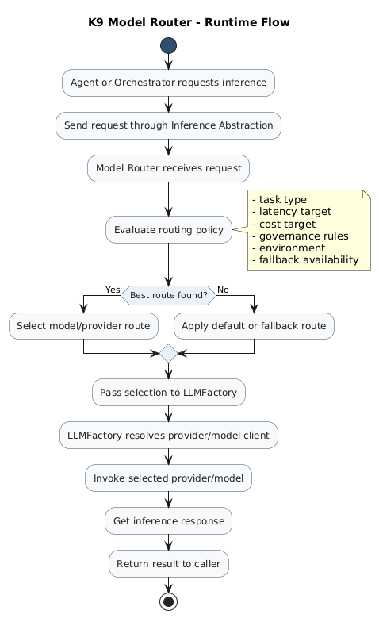

**Date:** 2026-03-15 (updated 2026-05-23)  
**Author:** Ravi Natarajan

## Motivation

Modern AI systems rely on multiple models with different strengths, costs, latency profiles, and governance constraints. A single model is rarely the right choice for every task. Hardcoding model choices inside every agent creates tight coupling, drives up cost, and makes compliance impossible to enforce consistently.

K9-AIF introduces the **K9ModelRouter** — a weighted-scoring model router built into the framework's inference layer. Every agent call goes through it. Model selection is centralized, governed, and fully observable.

---

## What the K9ModelRouter Does

The `K9ModelRouter` selects the most appropriate model for each `InferenceRequest` by scoring all catalog candidates and choosing the highest scorer. It is not a round-robin or a hardcoded priority list — it is a signal-driven decision.

Four signals drive the score:

| Signal | Condition | Score |
|---|---|---|
| Capability match | `task_type` appears in model's `capabilities[]` | +3 |
| Sensitivity gate | `sensitivity == "confidential"` and model has `"confidential"` capability | +2 |
| Latency match | `latency_budget` matches model's `latency_tier` | +2 |
| Cost match | `cost_profile` matches model's `cost_tier` | +2 |

The model with the highest total score wins. If no candidate scores above zero — no signal fired — the router falls back to the configured `default_model`.

---

## Architectural Position

The router belongs to the **inference layer** and sits between agents and model providers. Agents never call model providers directly.

```
Agent
  └─ llm_invoke(config, InferenceRequest)
       └─ ModelRouterFactory.get_router(config)     # cached router instance
            └─ K9ModelRouter.route(request)          # scores all catalog models
                 └─ ModelCatalog.get_model(alias)    # looks up llm_ref
                      └─ LLMFactory.get(llm_ref)    # cached OllamaLLM instance
                           └─ OllamaLLM.invoke(prompt)
```

This chain is the same for every agent in every squad. Agents declare a `task_type` in their YAML — the router resolves it to a model. No agent ever names a model directly.

---

## InferenceRequest — the Routing Contract

Agents build an `InferenceRequest` to signal what they need:

```python
from k9_aif_abb.k9_inference.models.inference_request import InferenceRequest

req = InferenceRequest(
    prompt="Assess this claim for fraud indicators...",
    task_type="reasoning",          # +3 for any model with "reasoning" capability
    sensitivity="confidential",     # +2 for models with "confidential" capability
    latency_budget="interactive",   # +2 if model's latency_tier matches
    cost_profile="standard",        # +2 if model's cost_tier matches
    metadata={"agent": "FraudDetectionAgent"},
)
```

All fields except `prompt` are optional. Omitting them degrades gracefully — the router simply fires fewer signals, which is fully backwards compatible.

---

## Concrete Example — EOC Model Catalog

The K9X Enterprise Insurance Operations Center configures four models:

| Alias | Model | Capabilities | Latency | Cost |
|---|---|---|---|---|
| `general` | llama3.2:1b | general, chat, summarization | realtime | minimal |
| `reasoning` | granite3-dense:2b | reasoning, adjudication, fraud, policy_compliance | interactive | standard |
| `guardian` | granite3-guardian:latest | guardrails, policy, confidential, pii_detection | interactive | standard |
| `extraction` | granite3-dense:2b | extraction, structured_output, ocr_post_processing | interactive | standard |

For a `FraudDetectionAgent` request with `task_type="reasoning"`:

- `reasoning` model scores: +3 (capability match) = **3.0**
- `guardian` model scores: 0 (no "reasoning" capability)
- `general` model scores: 0 (no "reasoning" capability)
- `extraction` model scores: 0

**Winner: `granite3-dense:2b` via the `reasoning` alias.**

For a `GuardAgent` request with `task_type="guardrails"` and `sensitivity="confidential"`:

- `guardian` model scores: +3 (guardrails) + 2 (confidential) = **5.0**
- All others: 0

**Winner: `granite3-guardian:latest`. No fallback. Hard requirement.**

---

## Persistence

After every routing decision, the router persists to the state store (SQLite in development, PostgreSQL in production):

- **Session** — created or resumed per request
- **Turn** — the user prompt, role, token count
- **Routing decision** — selected model, rationale, `complexity_score`, `governance_score`, `score`, provider metadata

`complexity_score` is derived from `task_type` (reasoning=0.8, extraction=0.6, general=0.3). `governance_score` is 1.0 when `sensitivity=="confidential"`, 0.0 otherwise. Both are stored alongside every decision — enabling compliance reporting and routing analytics.

Persistence backend is configured in `config.yaml`:

```yaml
inference:
  router:
    persistence: sqlite   # or "postgres" for production
```

---

## Why This Is an Architectural Concern

In most AI projects, model selection is buried in application code. K9-AIF treats it as a **first-class architectural concern** because the model chosen affects:

- operational cost
- latency
- compliance posture — some models must never handle PII
- deployment flexibility — swap providers without touching application code
- long-term maintainability

Centralizing this behind the router makes every model decision explicit, auditable, and changeable without modifying agents.

---

## For Developers

The full invocation pattern, how to add a model to the catalog, and how to extend the scoring signals are documented in [`SKILLS.md`](https://github.com/k9aif/k9-aif-framework/blob/main/SKILLS.md) (Skills 2, 3, 8).

The EOC is the reference implementation showing the router in production across 7 squads and 8 agents:
→ [K9X Enterprise Insurance Operations Center](https://github.com/k9aif/k9-aif-framework/tree/main/examples/K9X_Enterprise_Insurance_OperationsCenter)

---

## Architecture Diagram



---

K9-AIF is an architecture-first framework for governed, enterprise-scale multi-agent AI systems.

More at [k9x.ai](https://k9x.ai) · [github.com/k9aif/k9-aif-framework](https://github.com/k9aif/k9-aif-framework)
