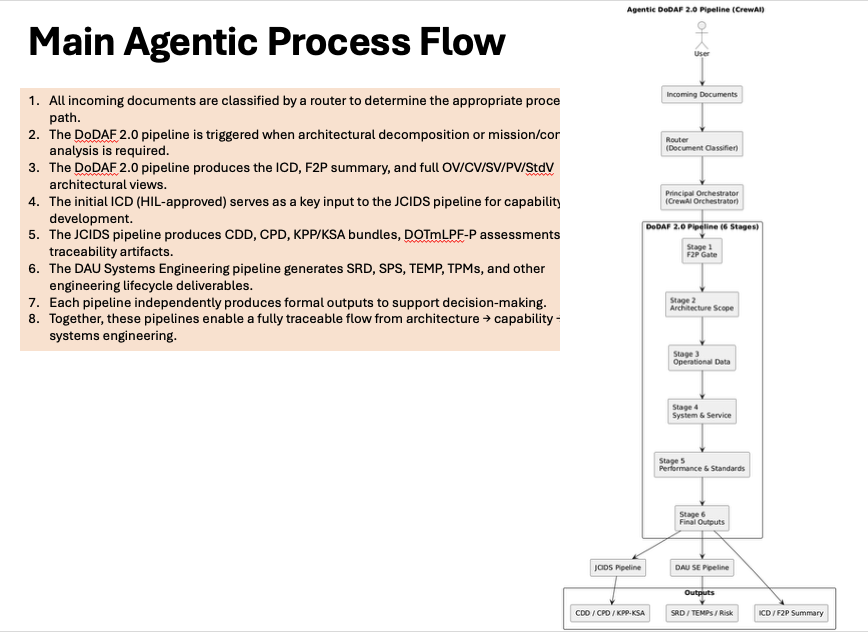

Modern systems engineering—especially under frameworks like DoDAF 2.0—requires processing large volumes of structured and unstructured inputs, generating multiple architectural views, and maintaining traceability across the entire lifecycle.

Traditionally, this process is manual, time-consuming, and difficult to scale.

This post presents an architecture-first approach to solving that problem using a **multi-agent pipeline built with CrewAI**, aligned with DoDAF 2.0 principles.

---

# The Core Idea

Instead of treating architecture generation as a monolithic workflow, we structure it as:

> **An orchestrated system of specialized agents, grouped into stages, each responsible for a well-defined architectural function.**

This enables:

- modular execution  
- clear separation of concerns  
- traceability across architectural artifacts  
- governed and repeatable processing  

---

The following diagram illustrates the end-to-end agentic pipeline:

*Figure: Multi-agent DoDAF 2.0 pipeline showing document routing, orchestration, and stage-based execution.*

---

# High-Level Architecture

The system follows a layered agentic architecture:

Pipeline (SBB)
→ Principal Orchestrator
→ Stage Squads
→ Specialized Agents
→ Outputs (ICD, OV, SV, PV)

- **Orchestrator** coordinates execution  
- **Squads** represent logical stages  
- **Agents** perform specific tasks  
- **Outputs** are structured DoDAF artifacts  

---

# The 6-Stage DoDAF Pipeline

The pipeline is divided into six stages, each aligned with DoDAF 2.0 viewpoints and lifecycle practices:

## Stage 1 — Fit-for-Purpose (F2P) Gate

Determines whether full architectural processing is required.

- Applies rules-based evaluation  
- Produces a routing decision  
- Prevents unnecessary computation  

---

## Stage 2 — Architecture Scope & ICD Framing

Initializes the architecture:

- capability definition  
- scope identification  
- gap analysis  

This stage begins the **Initial Capabilities Document (ICD)**.

---

## Stage 3 — Operational Data Extraction

Extracts operational facts:

- actors  
- activities  
- operational flows  

Outputs structured data aligned with DoDAF’s **Operational Viewpoint (OV)**.

---

## Stage 4 — System & Service Modeling

Maps operational requirements to systems and services:

- system relationships  
- service interactions  
- traceability to operational needs  

Supports **System View (SV)** and **Service View (SvcV)**.

---

## Stage 5 — Performance & Standards Analysis

Evaluates:

- Key Performance Parameters (KPPs)  
- Key System Attributes (KSAs)  
- standards compliance  

Aligns with **Performance View (PV)** and **Standards View (StdV)**.

---

## Stage 6 — Initial Document Assembly

Assembles architecture-driven outputs into structured deliverables:

- Initial ICD (architecture-derived, HIL-reviewed)  
- F2P summary  
- OV/CV/SV/PV/StdV artifacts  

This stage focuses on consolidating architectural insights into a coherent initial document.

It does not complete the full capability development lifecycle. The initial ICD serves as input to the **JCIDS pipeline**, which performs further analysis and produces formal capability documents such as CDD, CPD, and KPP/KSA bundles.

---

# Multi-Agent Design with CrewAI

Each stage is implemented as a **CrewAI squad**:

- multiple agents collaborate within a stage  
- agents share intermediate outputs  
- results are validated before moving forward  

This provides:

- isolation between stages  
- better error containment  
- improved reasoning through collaboration  

---

# Orchestration Model

A **Principal Orchestrator** acts as the central coordination layer across the system.

It is responsible for:

- interpreting routing decisions from the intake layer  
- triggering the appropriate pipeline  
- managing stage execution within each pipeline  
- controlling data flow between stages and downstream systems  

The orchestrator ensures that execution is **structured, deterministic, and traceable**, while still allowing flexibility in how different pipelines are invoked.

---

## Coordinated Pipeline Execution

The system operates across three coordinated pipelines:

- **DoDAF 2.0 Pipeline** → performs architectural decomposition and produces the initial ICD and full architectural views  
- **JCIDS Pipeline** → consumes the initial ICD and performs capability development (CDD, CPD, KPP/KSA, DOTmLPF-P)  
- **Systems Engineering (DAU) Pipeline** → produces engineering artifacts (SRD, SPS, TEMP, TPMs)  

Each pipeline is independently orchestrated but connected through structured outputs and inputs.

The **Principal Orchestrator governs the transitions between these pipelines**, ensuring a consistent and traceable flow from:

> architecture → capability → systems engineering

---

# Technology Architecture

The pipeline integrates multiple technologies, each serving a distinct purpose:

- **CrewAI** → multi-agent orchestration  
- **Neo4j** → graph-based architectural data (DM2 alignment)  
- **PostgreSQL** → structured stage outputs  
- **Rules Engine** → deterministic governance  
- **Event Bus (Kafka/Redpanda)** → stage coordination  
- **Diagram Generators (PlantUML / SysML tools)** → view rendering  

This separation ensures:

- no overlap in responsibilities  
- clear data ownership  
- scalable architecture  

---

# Why This Approach Matters

This architecture introduces a key shift:

> **From document processing → to orchestrated architectural reasoning**

Key benefits:

- end-to-end traceability  
- modular architecture generation  
- governed decision-making  
- scalable multi-agent execution  

---

# Key Insight

The most important takeaway is not the use of agents—but **how they are structured**.

> When architecture workflows are modeled as orchestrated agent systems, they become:
>
> - composable  
> - extensible  
> - and production-ready  

---

# Closing Thoughts

Agent frameworks alone are not enough.

The real value comes from combining:

- **architecture-first design**
- **clear orchestration patterns**
- **structured stage decomposition**

This approach transforms complex systems engineering workflows into **manageable, scalable, and governed pipelines**.

---

# Next Steps

Future enhancements could include:

- human-in-the-loop approval stages  
- dynamic routing based on mission context  
- deeper integration with modeling tools  
- automated generation of architectural views  

---

If you’re exploring agentic systems in enterprise or systems engineering contexts, this pattern provides a strong foundation to build on.

---

