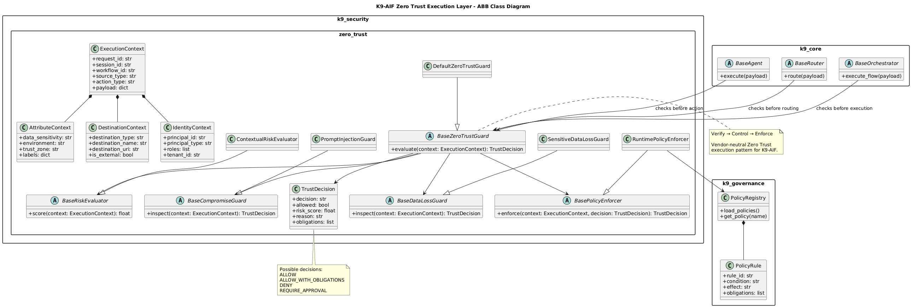

Zero Trust is everywhere right now.

But most implementations still focus on **access**:

- Who can log in  
- Who can call an API  
- Who can reach a system  

That model breaks down with agentic systems.

Because the real risk is not access.

It is what the system is allowed to do.

---

## From Access Control to Execution Control

An agent may be fully authorized — and still:

- leak sensitive data  
- call the wrong external system  
- follow malicious instructions  
- execute unintended actions  

So the question shifts from:

> “Can this entity access the system?”

to:

> **“Should this action be executed right now?”**

---

## Zero Trust Execution Layer

In K9-AIF, this led to a different approach:

A **Zero Trust Execution Layer**.

Every action — whether initiated by an agent, orchestrator, or workflow — is:

- verified  
- context-evaluated (identity, data sensitivity, destination)  
- risk-scored  
- policy-controlled  

Not at the edge.  
Not at login.  
But **at the moment of execution**.

---

## Execution Flow

Here’s how the execution flow works:


Zero Trust is applied directly within the orchestration flow:

- **ExecutionContext** captures identity, attributes, and destination  
- **Guards** evaluate risk, compromise signals, and data exposure  
- A **TrustDecision** is produced before execution  
- A **PolicyEnforcer** applies obligations such as masking or audit logging  

---

## Decision Model

Instead of a binary allow/deny, the system supports:

- **ALLOW**  
- **ALLOW_WITH_OBLIGATIONS**  
- **DENY**  
- **REQUIRE_APPROVAL**  

This enables controlled execution rather than simple blocking.

---

## ABB Class Structure

The execution flow above is implemented in K9-AIF using ABB-level security components.

[](../assets/images/blogs/k9-security_class_diagram.png)

The diagram shows how the Zero Trust layer is structured around:

- `ExecutionContext`
- `BaseZeroTrustGuard`
- `BaseRiskEvaluator`
- `BaseCompromiseGuard`
- `BaseDataLossGuard`
- `BasePolicyEnforcer`
- `TrustDecision`

This keeps the pattern extensible while allowing concrete SBB implementations to plug into the framework.


---

## Architectural Integration in K9-AIF

The Zero Trust Execution Layer is not a standalone component.

It is implemented as a native capability within the K9-AIF framework and integrated directly into the core execution pipeline.

When enabled through `config.yaml`, Zero Trust enforcement is applied automatically at every agent execution boundary.

The framework integrates this capability into its core Architecture Building Blocks (ABB):

- **BaseRouter** → evaluates requests before routing
- **BaseOrchestrator** → coordinates execution across workflows
- **BaseAgent** → enforces configurable pre- and post-execution verification around every agent invocation

Built using K9-AIF’s Architecture Building Blocks (ABB), the Zero Trust Execution Layer is:

- reusable
- extensible
- configuration-driven
- consistently enforced across every agent execution boundary

Applications do not implement Zero Trust themselves. They simply enable it through configuration. The framework applies the appropriate security controls before and after every agent executes.

Two configuration keys are all that is required. In `config.yaml`, the `security.zero_trust` block switches enforcement on. In the agent’s YAML, the `governance` flags determine which hooks fire:

```yaml
# config.yaml — enable Zero Trust enforcement
enable_zero_trust: true    # read by BaseOrchestrator at startup
```

```yaml
# agent.yaml — pre/post governance hooks
governance:
  pre_process: true    # Zero Trust evaluation fires before the agent reaches the LLM
  post_process: true   # policy obligations (masking, audit) applied after the response
```

`enable_zero_trust: true` activates enforcement on the orchestrator. `pre_process: true` means every execution context is evaluated and risk-scored before the LLM is called. `post_process: true` means any obligations produced by the TrustDecision — redaction, audit logging, escalation — are applied before the result leaves the agent. Both governance flags default to `false`; you opt agents in individually.

> Zero Trust is not a gate. It is a layer.

---

## Example Scenarios

The demo implementation includes:

- **Low-risk internal request → ALLOW**  
- **Sensitive external request → ALLOW_WITH_OBLIGATIONS (mask + audit)**  
- **Prompt injection attempt → DENY**  

These flows are not only executed but also visualized.

---

## Visualization

The architecture is available as a live graph in the K9-AIF Graph Explorer.
👉 https://graph.k9x.ai

Navigate to:

**Examples → Zero Trust Execution Demo**

This makes it possible to:

- explore relationships between components  
- trace execution flow visually  
- understand where control is applied  

---

## Why This Matters

Most agent frameworks focus on:

- coordination  
- task execution  
- orchestration  

What’s missing is:

> **control over execution itself.**

As agentic systems become more autonomous, this becomes the critical layer.

---

## Closing Thought

Zero Trust in agentic systems is not about controlling access.

It is about controlling execution.

And that shift changes how we design AI systems.

---

## References

- K9-AIF Framework: https://github.com/k9aif/k9-aif-framework
- PyPI: https://pypi.org/project/k9-aif/
- Blog: https://blog.k9x.ai

---

*This is Part 1 of the K9X Shield series. Part 1 covers the Zero Trust Execution Layer — controlling who does what and whether an action should execute. [Continue to Part 2 → K9X Shield: Security as an Architectural Capability](/k9x-shield-chain-of-vulnerability-tests/), which covers payload-level inspection — controlling what enters the processing pipeline.*

*For a complete overview of what ships in the framework: [K9X Shield — Security as a Framework Capability, Not a Post](/k9x-shield-framework-security-capability/)*