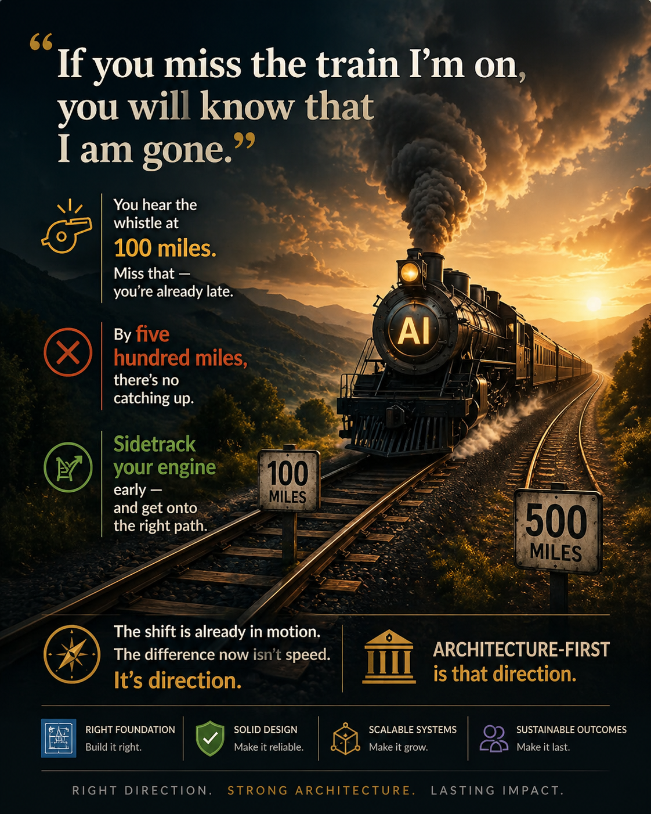
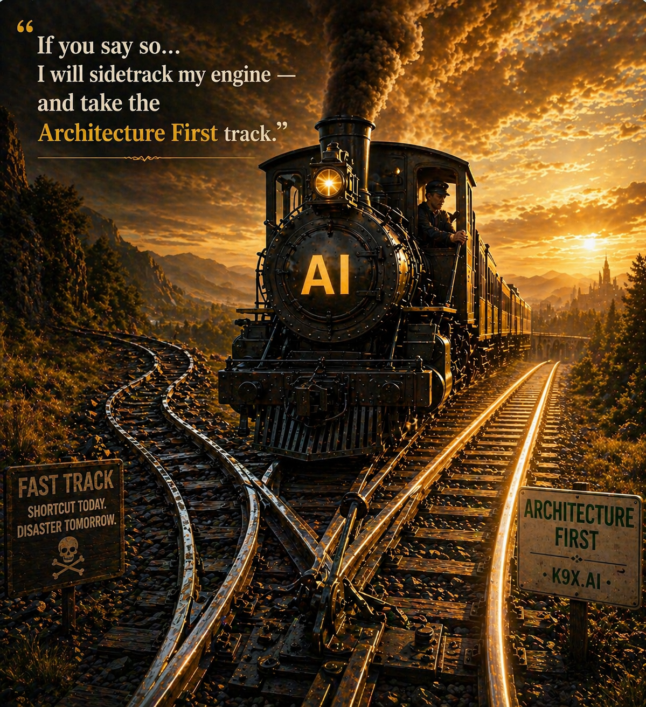

Not every AI journey is about speed.

The ones that last…  
start with getting the direction right.

---

## The Missed Track

Many AI systems fail not because of lack of effort —  
but because they start without architectural direction.

You can hear the signals early.  
But if ignored, by the time the impact is visible…  
it’s already too late.

---

## The Decision Point

The critical moment isn’t in production.

It’s at the start.

Choosing architecture early determines whether a system scales —  
or collapses under its own complexity.

---

## Arrival

When architecture leads, outcomes change.

Systems are not just functional —  
they are governed, scalable, and built to last.

---

## 500 Miles — Architecture First  
*(inspired by Robert Plant & Saving Grace)*

If you miss the track I’m on  
You will know that I am gone  
You will hear the signal fire a hundred miles  
A hundred miles  
You will hear the signal fire a hundred miles  

And if you say so…  
I will sidetrack my engine  
And take the Architecture First  
Architecture First  
I’ll sidetrack my engine and take the Architecture First  

Lord, I’m one layer deep, Lord, I’m two  
Lord, I’m three, Lord, I’m four  
Lord, I’m five hundred miles toward a system that works  
A system that works  
Lord, I’m five hundred miles toward a system that works  

And when I arrive  
The foundation is right  
The design is solid, the outcome will last  
It will last  
Architecture First — built to last

---

## Closing

Architecture isn’t overhead.

It’s the difference between prototypes…  
and systems that deliver value in production.

Architecture First is how AI systems are built to scale, govern, and endure.

Architecture First — built to last.

---

## Learn More

K9-AIF is an architecture-first framework for modular, governed,  
agentic AI systems.

Explore more:

<a href="https://k9x.ai" target="_blank" rel="noopener noreferrer">
  https://k9x.ai
</a>