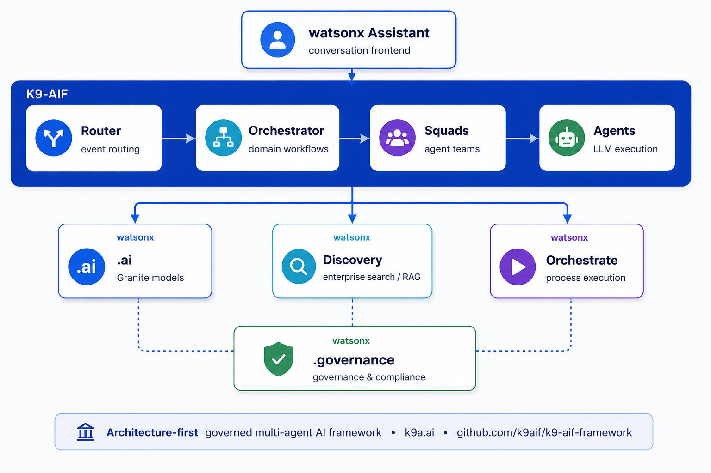

One of the most common questions I receive about K9-AIF is:

> **"Where exactly does K9-AIF sit in relation to IBM Watsonx and other enterprise AI platforms?"**

It is a fair question — the enterprise AI ecosystem already includes orchestration frameworks, agent runtimes, assistants, workflow platforms, model gateways, and low-code automation tools.

The short answer:

> **K9-AIF does not replace these systems. It provides the architecture, governance, routing, and integration layer that connects and governs them — across their boundaries.**

---

## Understanding the Layers

| Layer                                     | Responsibility                                      | Examples                           |
| ----------------------------------------- | --------------------------------------------------- | ---------------------------------- |
| **User / Business Layer**           | Business workflows and user experiences             | Support portals, claims dashboards |
| **Architecture & Governance Layer** | Cross-system routing, governance, audit, Zero Trust | **K9-AIF**                   |
| **Agent Collaboration Layer**       | Agent teamwork and task execution                   | CrewAI, LangGraph                  |
| **Enterprise AI Services**          | Models, workflow engines, AI tooling                | Watsonx suite, OpenAI              |
| **Infrastructure Layer**            | Storage, APIs, messaging, databases                 | Kafka, PostgreSQL, Neo4j           |

K9-AIF operates in the **architecture and governance layer** — above agent runtimes, but below business applications. It can coexist with every layer without replacing any of them.

---

## Example 1 — IBM Watsonx Suite + K9-AIF

*K9-AIF as the architectural layer connecting the IBM Watsonx suite — routing, governance, and cross-platform coordination across product boundaries.*

This is the integration I think about most, because the Watsonx suite is comprehensive:

**watsonx Assistant** · **watsonx.ai** · **Watson Discovery** · **watsonx Orchestrate** · **watsonx.governance** · **watsonx.data**

Each product is strong within its own domain. And the suite is fast-moving — capabilities like MCP support, model routing, and governance controls are being added continuously. Each product is evolving toward richer self-governance within its own execution environment.

That is exactly the architectural point.

The question enterprise architects eventually ask is: **who governs the connections between them?**

Who routes an event from watsonx Assistant into a multi-agent reasoning pipeline, calls Watson Discovery for document retrieval, triggers an Orchestrate workflow for process execution, and produces an audit trail that spans all of it — enforcing Zero Trust and governance *at the system level*, not just inside one product?

That is what K9-AIF is designed to provide: the architectural layer *above* the product boundaries.

K9-AIF is not competing with any Watsonx product. It is the architectural connective tissue the suite does not ship — but every serious enterprise implementation needs.

---

## Example 2 — Assistants and Existing Enterprise Systems

Most enterprises already have internal assistants, chatbot systems, or legacy orchestration tools. K9-AIF treats these as composable services within a larger architecture.

The K9EventRouter determines:

- where a request should flow
- which orchestrator and squad handles it
- which models are permitted for that request type
- which governance policies apply

This creates architectural consistency across otherwise disconnected systems — HR assistants, support assistants, claims processors, and compliance tools can all route through the same governed pipeline.

---

## Where K9-AIF Adds the Most Value

K9-AIF becomes most valuable when organizations face:

- **Agent sprawl** — multiple frameworks, inconsistent patterns, no architectural structure
- **Governance gaps** — models running without audit trails, PII controls, or confidence thresholds
- **Cross-system integration** — multiple AI products that each govern themselves but nothing governs the connections between them
- **Scaling from prototype to production** — the architecture that works for a demo does not always hold under enterprise requirements

This is especially relevant in healthcare, insurance, banking, government, and defense — regulated environments where auditability, Zero Trust, and compliance are non-negotiable.

---

## Final Thoughts

The enterprise AI future will not be a single framework. Organizations will combine orchestration systems, AI services, assistants, workflows, and agent runtimes — and they will need an architectural layer that connects and governs all of it.

Not replacing the ecosystem. Organizing it into something scalable, governed, and production-ready.

Architecture First.

— Ravi

---

*More at [k9x.ai](https://k9x.ai) · [github.com/k9aif/k9-aif-framework](https://github.com/k9aif/k9-aif-framework)*
