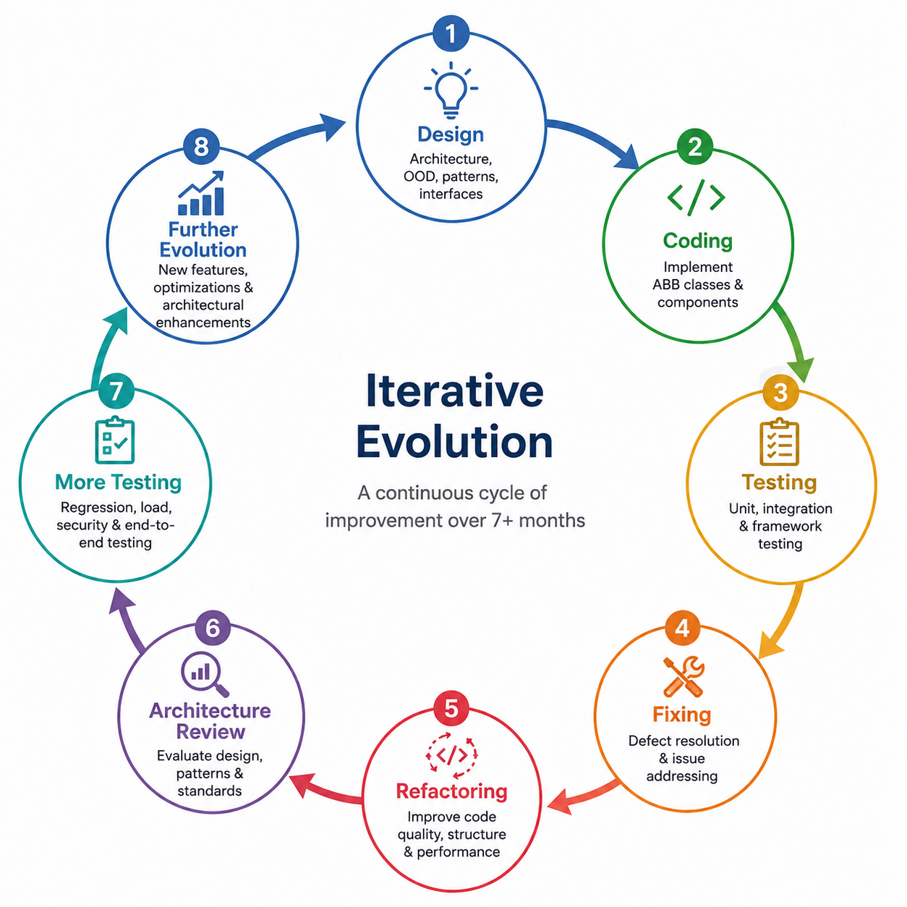

One of the most interesting parts of the K9-AIF journey was not just building the framework itself — but visualizing it.

The result eventually became:

Live Graph:

[https://graph.k9x.ai](https://graph.k9x.ai)

A live graph visualization of the K9-AIF framework structure, relationships, runtime components, orchestration layers, and example applications.

But the graph was never the starting point.

The architecture was.
---

# Architecture First

The K9-AIF framework ABB classes evolved over roughly seven months.

The graph was therefore not simply a visualization layer.

It became a living architectural representation of the framework itself.

# The Hard Part Was Not Neo4j

Neo4j itself was not the hardest part.

The harder challenge was deciding:

* What should be visualized?
* Which relationships matter?
* What views are useful?
* How should runtime flow appear?
* How should inheritance appear?
* What should architects see?
* What should developers see?
* What should orchestration views show?
* How should examples be isolated?
* Which relationships create clutter?

Several visualization layers eventually emerged:

* Framework Views
* Core ABB Views
* Runtime Views
* Example Application Views
* Inheritance Views
* Orchestration Flow Views
* Factory Relationship Views

The design of the graph navigation itself became an architectural exercise.

---

# **The Bigger Lesson**

One major takeaway from the process was this:

Architecture-first systems naturally produce richer semantic graphs.

When architecture is intentional:

* AI reasoning improves
* Relationship inference improves
* Visualization quality improves
* Extensibility improves
* Governance improves
* Runtime traceability improves

The graph eventually became more than documentation.

It became a living architectural representation of the framework itself.

---

# **Closing Thoughts**

graph.k9x.ai was never intended to be “just another graph visualization.”

It became an experiment in how architecture discipline, structured engineering, iterative framework evolution, and AI-assisted reasoning can work together.

The graph emerged as a natural byproduct of intentional architecture.

And as the framework continues evolving, the graph evolves with it.

That may ultimately be the most important insight from the entire process.

---

K9-AIF

Architecture First.
