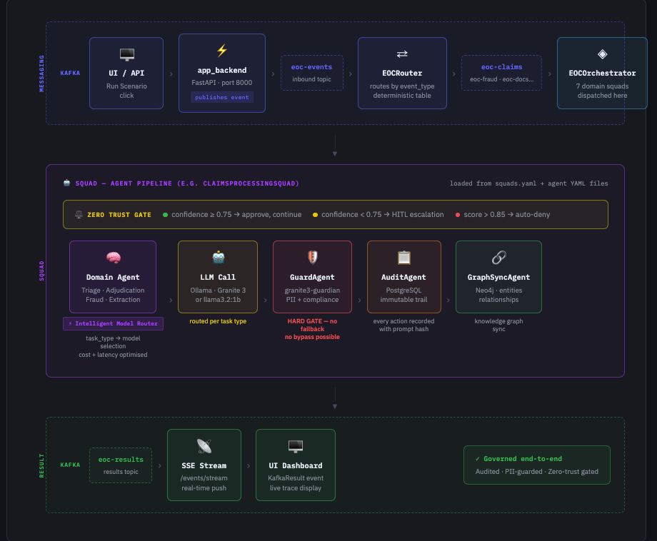
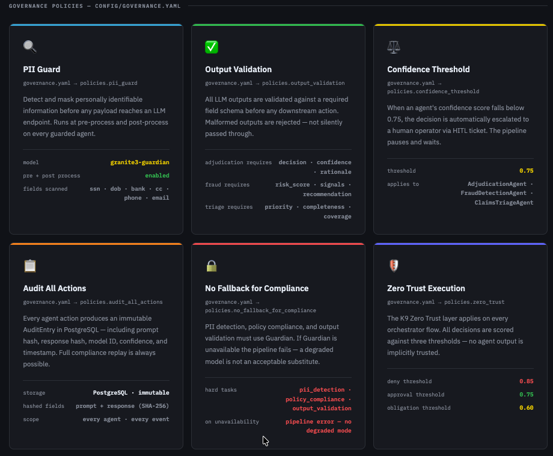
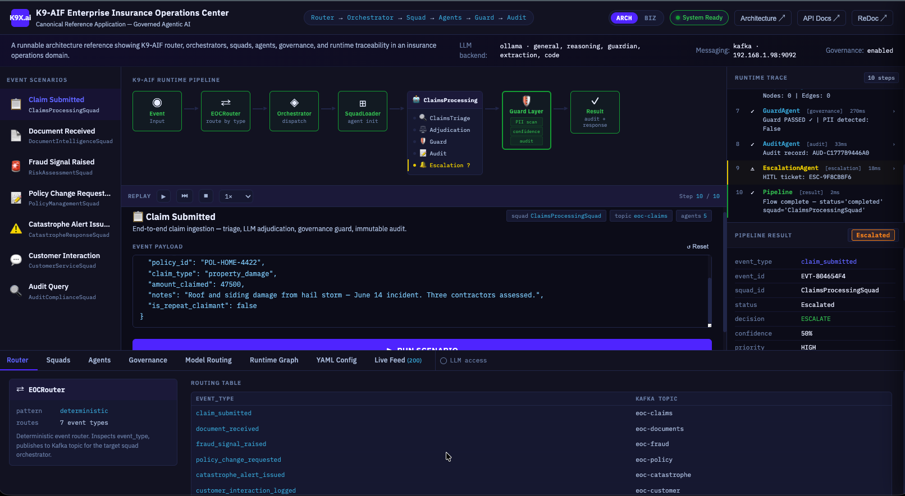
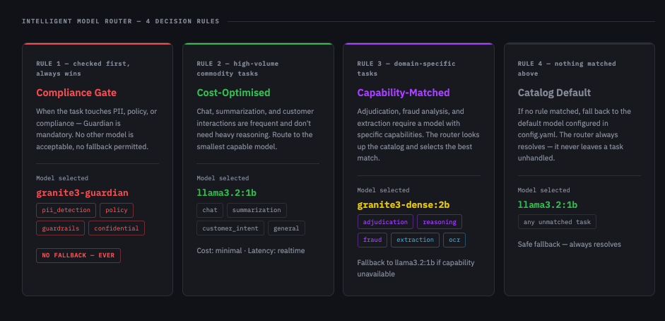
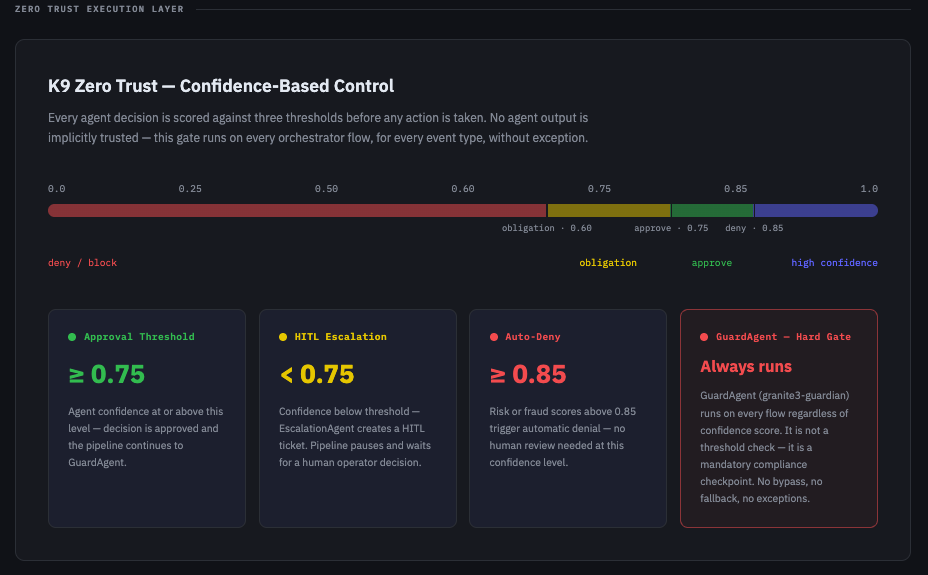

If you were building enterprise Java in the early 2000s, you remember the **J2EE PetStore**.

Sun Microsystems shipped it as the canonical reference application for J2EE — one coherent, runnable system that demonstrated every platform feature in a real domain: EJBs, JMS, Servlets, JNDI, MVC, database connectivity. Not a hello-world. Not a unit test. A complete application whose only job was to show you what the whole platform looked like when it was used correctly.

The **K9X Enterprise Insurance Operations Center (EOC)** is that for K9-AIF.

One coherent, runnable system. A real domain — insurance operations. Every framework feature working together: Kafka event routing, domain squads, intelligent model routing, zero trust execution, PII guard, immutable audit trail, Neo4j knowledge graph. Built entirely from YAML configuration, with no governance logic hardcoded in application code.

Many AI framework examples begin with focused applications — chat interfaces, summarizers, assistants, or small workflows. The EOC explores the next question serious enterprise adopters eventually ask: “What does a complete, governed, enterprise-grade K9-AIF application actually look like?”

---

## What the EOC Demonstrates

The EOC is an insurance operations platform that processes claims, detects fraud, extracts documents, manages policies, and responds to catastrophic events — all through a governed, auditable AI pipeline.

It demonstrates every major K9-AIF capability in a single coherent system:

- **Kafka-driven event pipeline** — every scenario run is an event, routed by topic and event type, never by hardcoded conditionals
- **7 domain squads** — Claims Processing, Risk Assessment, Document Intelligence, Customer Service, Policy Management, Audit & Compliance, Catastrophe Response
- **Intelligent Model Router** — selects the right model per task type (compliance gate → guardian, commodity tasks → 1b, reasoning → granite3-dense:2b)
- **Zero Trust Execution Layer** — confidence-scored gate on every agent output, HITL escalation below threshold, auto-deny above fraud threshold
- **GuardAgent** — granite3-guardian runs on every flow as a hard compliance gate, no fallback, no bypass
- **AuditAgent** — immutable PostgreSQL audit trail with SHA-256 prompt and response hashes
- **GraphSyncAgent** — Neo4j knowledge graph sync for entities and relationships across every processed event
- **SSE result streaming** — results pushed back to the dashboard in real time via Server-Sent Events

Everything is loaded from YAML. No routing logic, model assignments, or governance rules are hardcoded in application code.

---

## Architecture at a Glance

The full runtime architecture — including the Kafka flow, squad pipeline, model router rules, zero trust thresholds, and governance policies — is documented in the interactive blueprint below.



### Governance Policies



## Dashboard

[](/eoc-blueprint.html)

*The EOC dashboard showing a Claim Submitted scenario in flight: Kafka routing → ClaimsProcessingSquad → Guard Layer → escalation. The runtime trace on the right shows each agent step with latency. Pipeline result: Escalated at 50% confidence.*

> **[View the full interactive architecture blueprint →](../eoc-blueprint.html)**

The blueprint covers four sections:

1. **End-to-End Runtime Flow** — from UI click to Kafka topic to squad pipeline to SSE result
2. **Intelligent Model Router** — the four decision rules and per-agent model assignments
3. **Zero Trust Execution Layer** — confidence bar, approval thresholds, and the GuardAgent hard gate
4. **Governance Policies** — all six `governance.yaml` policies and their parameters

---

## The Model Router in Practice

One of the more instructive things about the EOC is how the model router forces an explicit decision for every agent. There is no default "use GPT-4 for everything." Each agent YAML declares a `task_type`, and the router resolves that to a model using four ordered rules:

| Priority           | Rule                              | Model selected                                         |
| ------------------ | --------------------------------- | ------------------------------------------------------ |
| 1st — always wins | Task touches PII / compliance     | `granite3-guardian` — no fallback ever              |
| 2nd                | High-volume commodity task        | `llama3.2:1b` — minimal cost, realtime              |
| 3rd                | Domain-specific capability needed | `granite3-dense:2b` — fallback to 1b if unavailable |
| 4th — catch-all   | Nothing matched above             | `llama3.2:1b` — always resolves                     |

This makes cost, latency, and compliance tradeoffs explicit in configuration — not buried in code.

### Model



---

## Zero Trust — Not a Checkbox

The EOC Zero Trust layer runs on every orchestrator flow without exception. It is not optional, and it is not just a confidence filter:

- Confidence **≥ 0.75** → approved, pipeline continues
- Confidence **< 0.75** → HITL escalation, EscalationAgent creates a ticket, pipeline pauses
- Risk/fraud score **≥ 0.85** → automatic denial, no human review needed
- **GuardAgent always runs** — regardless of confidence score, granite3-guardian is a mandatory compliance checkpoint on every flow

The separation between the confidence threshold (which gates agent decisions) and the GuardAgent (which gates PII and compliance) is intentional. They serve different purposes and run independently.



---

## Live Demo

The EOC is running live on RHEL at [eoc.k9x.ai](https://eoc.k9x.ai).

It is login-protected — if you are interested in a walkthrough, reach out directly. The login guard is in place to protect the server, not the ideas. Everything you need to understand and replicate the system is in the framework repository.

---

## Exploring the Code

The full EOC source is in the K9-AIF framework repository under:

```
examples/K9X_Enterprise_Insurance_OperationsCenter/
├── agents/yaml/          # agent definitions — task_type, model, governance
├── squads/yaml/          # squad composition and ordering
├── config/
│   ├── config.yaml       # model catalog and defaults
│   ├── governance.yaml   # all governance policies
│   ├── flows.yaml        # event-type to squad routing table
│   └── orchestrators.yaml
├── orchestrators/        # one orchestrator per domain
├── router/               # EOCRouter (Kafka) + EOCModelRouter
├── api/                  # FastAPI app backend
└── webui/                # dashboard, landing page, blueprint
```

The YAML files are the authoritative source. The Python code loads and executes them — it does not define policy.

---

## What This Example Is For

The EOC is not a template to copy. It is a reference implementation to read.

When you are designing your own K9-AIF application and asking "how should I structure the model router for compliance tasks?" or "where does the zero trust gate plug in?" — this is the answer. A complete, working system that made all those decisions and documented the reasons in YAML.

The [architecture blueprint](/eoc-blueprint.html) is the best place to start.

---
