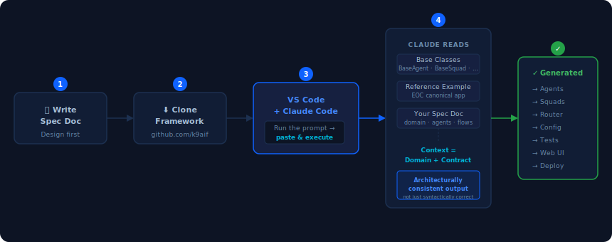

**Date:** 2026-05-23  
**Author:** Ravi Natarajan

I actually built the EOC example using Claude Code. The result is the [K9X Enterprise Insurance Operations Center](https://github.com/k9aif/k9-aif-framework/tree/main/examples/K9X_Enterprise_Insurance_OperationsCenter) — a production-grade, runnable multi-agent application covering claims processing, fraud detection, document intelligence, HITL escalation, and governed audit trails. Here's exactly how I built it — and you can do the same for your own domain.



---

## Prerequisite: Write your spec doc first

This is the real work. Think through your domain: what agents, what events, what flows. Document it — same format as the [K9-AIF EOC Project Spec](https://github.com/k9aif/k9-aif-framework/blob/main/examples/K9X_Enterprise_Insurance_OperationsCenter/docs/K9-AIF-EOC-Project-Spec-v0.2.docx) reference.

Architecture-first means you design before you code. Claude Code enforces that discipline.

---

## Steps

**1. Clone the framework**

```
github.com/k9aif/k9-aif-framework
```

**2. Create your project folder and drop in your spec doc**

```
examples/[YourProjectName]/docs/your-spec.docx
```

**3. Open in VS Code with Claude Code integrated**

**4. Run this prompt:**

---

> You are building a new application example on top of the K9-AIF framework located at `k9_aif_abb/`.
>
> Project details:
> - Application name: [e.g., K9X_Healthcare_ClaimsProcessor]
> - Create all files under: `examples/K9X_Healthcare_ClaimsProcessor/`
> - Spec doc location: `examples/K9X_Healthcare_ClaimsProcessor/docs/your-spec.docx`
>
> Before writing any code, read:
> 1. `CLAUDE.md` — framework architecture, execution hierarchy, and contracts
> 2. `SKILLS.md` — development recipes for agents, squads, LLM invocation, and governance
> 3. The canonical reference example: `examples/K9X_Enterprise_Insurance_OperationsCenter/`
> 4. The project specification document above.
>
> Then implement the new example following the same structure and conventions as the reference. Rules:
> - Every agent must extend `BaseAgent` and implement `execute()`
> - Every squad must be defined in a squad YAML with a `flow`
> - The router must route by `event_type`
> - Governance must be explicit — do not use `NoopGovernance` in production code
> - Folder structure, naming, and config patterns must match the reference example

---

## Why this works

The spec doc defines the **business domain**.  
The reference example defines the **framework contract**.  
`CLAUDE.md` and `SKILLS.md` give Claude Code the architecture and the recipes — so it knows not just what the framework is, but exactly how to build in it.

Together, they give Claude Code enough context to generate code that is architecturally consistent — not just syntactically correct.

That's the difference between a scaffold and a solution.

Try it and let me know what you build.

---

*Want to see the full output? Browse the [K9X Enterprise Insurance Operations Center](https://github.com/k9aif/k9-aif-framework/tree/main/examples/K9X_Enterprise_Insurance_OperationsCenter) on GitHub — the example application generated using exactly this approach.*
