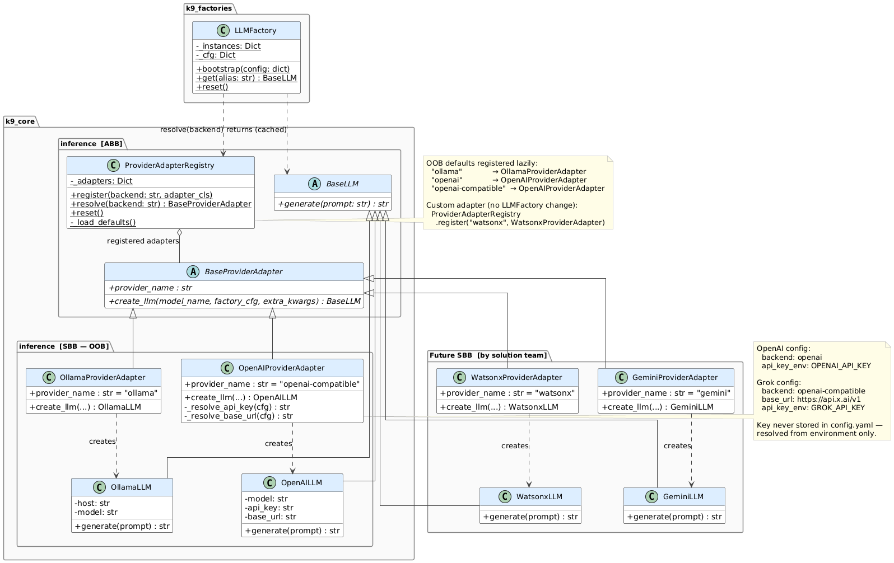

One of the quieter but important design decisions in K9-AIF is how the inference layer handles multiple LLM providers — and more importantly, how it stays open to future providers without the framework ever having to change.

The answer is the **Provider Adapter** pattern.

---

## The Extensibility Problem

An agentic framework that hardwires its LLM calls to a single provider is fragile. Teams switch providers. Enterprises have constraints — some require on-premise Ollama, others use OpenAI, others run IBM Watsonx. AI providers come and go. Models improve and get replaced.

The naive solution is a growing `if/elif` chain inside the factory:

```python
if backend == "ollama":
    return OllamaLLM(host=base_url, model=model_name)
elif backend == "openai":
    return OpenAILLM(api_key=..., model=model_name)
elif backend == "watsonx":
    return WatsonxLLM(...)
```

Every new provider modifies the factory. The factory accumulates knowledge it should not have — SDK details, API key conventions, URL patterns. It grows without bound. And every change risks breaking existing providers.

K9-AIF solves this structurally, not by adding more branches.

---

## The Pattern

The inference layer follows the same ABB/SBB principle that governs the rest of K9-AIF: the framework provides a stable contract, and concrete implementations are registered as extensions — without modifying any framework code.

```
LLMFactory
  → ProviderAdapterRegistry    (resolves by name)
  → BaseProviderAdapter        (ABB contract)
  → Concrete ProviderAdapter   (SBB — one per provider)
  → BaseLLM
```

<a href="../assets/images/blogs/k9-aif-inference-llm-provider-class-diagram.png" target="_blank">
  
</a>

`LLMFactory` reads `backend:` from config, asks the registry for the matching adapter, and calls `create_llm()`. That is all it does. It has no knowledge of Ollama, OpenAI, or Grok — and it never will.

---

## The ABB Contract

`BaseProviderAdapter` defines the contract every provider must satisfy:

```python
class BaseProviderAdapter(ABC):

    @property
    @abstractmethod
    def provider_name(self) -> str:
        """Registry key for this adapter."""
        raise NotImplementedError

    @abstractmethod
    def create_llm(
        self,
        model_name: str,
        factory_cfg: dict,
        extra_kwargs: dict,
    ) -> BaseLLM:
        """Construct and return a BaseLLM instance for this provider."""
        raise NotImplementedError
```

Two methods. That is the full interface a new provider must implement. `provider_name` is enforced by ABC — a subclass that omits it fails at instantiation, not silently at runtime.

---

## The Registry

`ProviderAdapterRegistry` maps backend names to adapter classes. OOB adapters (Ollama, OpenAI, OpenAI-compatible) are registered automatically on first use. Custom adapters are registered by solution code — no registry modification, no factory change:

```python
ProviderAdapterRegistry.register("watsonx", WatsonxProviderAdapter)
```

The factory dispatch then becomes three lines:

```python
backend = (fcfg.get("backend") or fcfg.get("provider") or "ollama").lower()
adapter  = ProviderAdapterRegistry.resolve(backend)
inst     = adapter.create_llm(model_name, fcfg, extra_kwargs)
```

---

## OOB Adapters

Three adapters ship with the framework:

| Backend key | Adapter | Covers |
|---|---|---|
| `ollama` | `OllamaProviderAdapter` | Local Ollama server |
| `openai` | `OpenAIProviderAdapter` | OpenAI API |
| `openai-compatible` | `OpenAIProviderAdapter` | Grok/xAI, any OAI-compatible endpoint |

`OpenAIProviderAdapter` serves both OpenAI and Grok — the same `OpenAILLM` with a different `base_url` and API key. No second adapter needed.

API keys are resolved from environment variables via `api_key_env: MY_ENV_VAR` in config — never stored in `config.yaml`.

---

## Adding a New Provider

This is where the pattern pays off. Adding Watsonx, Gemini, Bedrock — or any future provider — requires one file and one registration call. Nothing else in the framework changes.

```python
from k9_aif_abb.k9_core.inference.base_provider_adapter import BaseProviderAdapter
from k9_aif_abb.k9_core.inference.provider_registry import ProviderAdapterRegistry


class WatsonxProviderAdapter(BaseProviderAdapter):

    @property
    def provider_name(self) -> str:
        return "watsonx"

    def create_llm(self, model_name, factory_cfg, extra_kwargs) -> BaseLLM:
        api_key = os.environ.get(factory_cfg.get("api_key_env", "WATSONX_API_KEY"), "")
        return WatsonxLLM(api_key=api_key, model=model_name, **extra_kwargs)


ProviderAdapterRegistry.register("watsonx", WatsonxProviderAdapter)
```

Set `backend: watsonx` in `config.yaml`. Done.

`LLMFactory`, `llm_invoke`, agents, squads, orchestrators, the model router — none of these change. The adapter is entirely below the factory's public surface.

---

## What Stays Stable

The full call chain above `LLMFactory.get()` is identical regardless of which provider is active:

```
agent:  llm_invoke(self.config, req)
          → ModelRouterFactory.get_router()
          → K9ModelRouter.invoke()
          → LLMFactory.get(alias)        ← adapter resolved here
              → OllamaLLM / OpenAILLM / WatsonxLLM / ...
```

Existing agents, squads, orchestrators, and example applications require no changes when the provider changes. The adapter layer is completely transparent to everything above it.

---

## Design Principle

> ABB provides the stable inference contract and factory mechanism.
> Provider adapters are SBB-style realizations.
> Future providers are added by registering a new adapter — not by modifying the framework.

This is the same principle K9-AIF applies to agents, routers, governance, and persistence. The framework defines contracts. Solutions implement them. The boundary between the two never moves.

---

## Nothing is Hardwired

The Provider Adapter pattern is not unique to the inference layer. It is how K9-AIF is designed throughout.

Every major component in the framework is an abstract contract — an ABB — that a solution team realizes as an SBB without touching the core. No technology choice, no provider, no infrastructure dependency is hardcoded into the framework itself.

| Layer | ABB Contract | OOB Realization | Extend Without Changing |
|---|---|---|---|
| **LLM Inference** | `BaseLLM` | `OllamaLLM` | Add `OpenAILLM`, `WatsonxLLM`, any backend |
| **Provider selection** | `BaseProviderAdapter` | `OllamaProviderAdapter`, `OpenAIProviderAdapter` | Register new adapter — factory unchanged |
| **Model routing** | `BaseModelRouter` | `K9ModelRouter` | Swap in cost-optimized or compliance router |
| **Agent execution** | `BaseAgent` | `K9ValidationLoopAgent`, `K9CriticActorAgent` | Implement any reasoning pattern |
| **Governance** | `BaseGovernance` | `NoopGovernance` | Plug in real policy engine — agents unchanged |
| **Persistence** | `BaseModelRouter` persistence | SQLite | Switch to PostgreSQL via config — no code change |
| **Messaging** | `BaseMessageBus` | Kafka / Redpanda adapter | Replace with any message broker |
| **Tool integration** | `BaseMCPAgent` | `MCPHttpConnector`, `MCPStdioConnector` | Connect any MCP-compatible tool server |

The pattern is the same at every layer:

- The **ABB** defines the contract — interface, lifecycle, governance hooks
- The **OOB SBB** provides a ready-to-run default — usable without modification
- A **custom SBB** extends the ABB and registers itself — the framework never changes

This means a team can replace the governance engine, the message broker, the LLM provider, or the model router independently of each other, independently of the agents, and independently of the framework release cycle. Each decision is local. Nothing cascades.

When the AI landscape shifts — and it will — K9-AIF applications adapt by registering a new adapter, not by rewriting agent logic.

That is the intent behind K9-AIF: a framework built on ABBs that is ready to be extended as the industry evolves — without breaking what already works. The patterns are not new. OOA, OOD, UML, and TOGAF have proven themselves across decades of enterprise software. K9-AIF applies that same rigour to agentic AI.

---

*Provider adapters are in `k9_aif_abb/k9_core/inference/`. The framework is open source at [github.com/k9aif/k9-aif-framework](https://github.com/k9aif/k9-aif-framework).*
