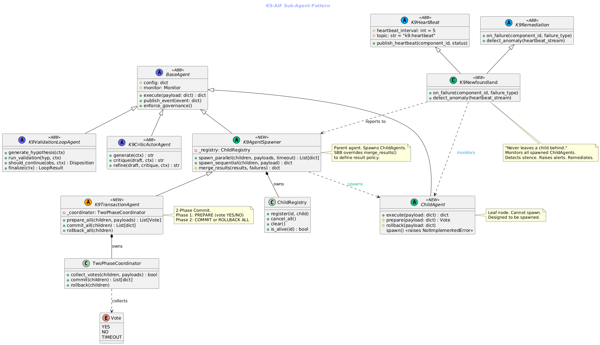

**Date:** 2026-06-04  
**Author:** Ravi Natarajan

---

## What It Is

The K9-AIF Sub-Agent Pattern applies the multithreading model to agents. A parent agent — `K9AgentSpawner` — spawns lightweight `ChildAgents` that execute concurrently and independently, then merges their results.

This is a well-understood computing concept brought into the agentic framework with enterprise-grade contracts, lifecycle guarantees, and governance.

---

## How It Is Applied in the K9-AIF Framework

The K9-AIF execution hierarchy is:

```
K9EventRouter → Orchestrator → Squad → Agent
```

The Sub-Agent Pattern extends this naturally:

```
K9EventRouter → Orchestrator → Squad → K9AgentSpawner (parent)
                                              ├── ChildAgent (parallel)
                                              ├── ChildAgent (parallel)
                                              └── ChildAgent (parallel)
                                                     ↓
                                              merge_results()
```

A `K9AgentSpawner` is a `BaseAgent` that can spawn `ChildAgents`. `ChildAgents` are leaf nodes — they execute and return results. They cannot spawn further agents. The parent controls execution strategy and merges results.

**Three execution modes:**

- **Parallel** — all children simultaneously, parent joins: `spawn_parallel(children, payloads)`
- **Sequential** — children in order, each enriches shared context: `spawn_sequential(children, payload)`
- **Tree** — spawner spawns spawners, bounded to depth 2

---

## Use Case Scenarios

**1. Scaffold Generation (K9X StudioX)**
Generating 20 files for a project scaffold — all files are independent. One `K9AgentSpawner` spawns one `ChildAgent` per file, all execute in parallel. 10x faster than sequential generation.

**2. Spec Document Analysis**
Parsing a Process Studio output: extract project metadata, extract agent definitions, map zones — three independent extractions. One spawner, three ChildAgents running simultaneously.

**3. Multi-System Validation**
A payment requires fraud check, balance check, and compliance check — all independent queries. Spawner fires three ChildAgents in parallel, merges votes. If all pass, proceed.

**4. Insurance Claims Processing**
FNOL intake, policy verification, document retrieval — three deterministic steps with no dependency. Spawned in parallel, significantly reducing claim intake time.

**5. Reporting and Analytics**
Generate loss ratio, cycle time, and leakage analysis simultaneously — three independent calculations over the same dataset. One spawner, three ChildAgents, results merged into a single report.

---

## Benefits to Solutions

- **Throughput** — independent work units run simultaneously instead of sequentially
- **Latency reduction** — total time = slowest child, not sum of all children
- **Resource efficiency** — dedicated thread pool per spawner, no shared contention
- **Clean separation of concerns** — each ChildAgent handles exactly one responsibility
- **Testability** — ChildAgents are small, focused, independently testable classes
- **Reusability** — ChildAgents can be reused across different spawners and squads

---

## Core Principles

**No Orphan Children**
If a parent agent fails mid-execution, all running children are immediately cancelled — not left running, not abandoned. The `ChildRegistry` tracks every spawned child. `try/finally` guarantees cleanup regardless of success or failure.

```python
try:
    return self._execute_parallel(children, payloads, timeout)
except Exception:
    self._registry.cancel_all()   # parent failed → cancel all children
    raise
finally:
    self._registry.clear()        # always cleanup
```

**No Deadlocks — 4 Structural Rules**

| Rule | What it prevents |
|---|---|
| Leaf Node Rule — ChildAgent.spawn() raises NotImplementedError | Circular spawning |
| Mandatory Timeout — no indefinite waits | Indefinite blocking |
| No Shared Mutable State — payloads deep-copied per child | Resource contention |
| Bounded Concurrency — max 20 children, dedicated pool | Thread exhaustion |

Deadlock is structurally impossible — prevented at design time, not handled at runtime.

**Result Policy — SBB Decides**
The solution building block (SBB) decides what happens when children fail — accept partial results, retry, or abort. Overridable via `merge_results()`:

```python
class MySpawner(K9AgentSpawner):
    def merge_results(self, results, failures):
        # SBB decides: partial OK? retry? abort?
```

**Governance Inheritance**
Parent's governance configuration flows to all ChildAgents. No child executes outside the governance boundary its parent defines.

**Formal ABB Contract**
`ChildAgent` is a typed class in the K9-AIF hierarchy — not a runtime behavior or configuration option. Architects design with it. Developers extend it. Governance enforces it.

---

## The Class Hierarchy



```
BaseAgent
├── K9ValidationLoopAgent     ← iterative convergence
├── K9CriticActorAgent        ← generate-critique-refine
├── ChildAgent                ← leaf node, cannot spawn (NEW)
└── K9AgentSpawner            ← spawns ChildAgents (NEW)
      └── K9TransactionAgent  ← 2-Phase Commit variant (NEW)
```

---

## K9TransactionAgent: All-or-Nothing

For scenarios where partial results are unacceptable — payments, compliance filings, multi-system state changes — `K9TransactionAgent` extends `K9AgentSpawner` with 2-Phase Commit:

- **Phase 1 — PREPARE:** each child votes YES or NO
- **Phase 2 — COMMIT** if all YES, **ROLLBACK** if any NO

---

## K9Newfoundland: The Watchdog That Never Leaves a Child Behind

Named after the loyal, protective Newfoundland breed — `K9Newfoundland` monitors every spawned ChildAgent, detects silence, raises alerts, and remediates failures. It never abandons its charges.

```python
class K9Newfoundland(K9HeartBeat, K9Remediation):
    """
    Monitors spawned ChildAgents.
    Detects silence. Raises alerts. Remediates failures.
    Never leaves a child behind.
    """
    def on_failure(self, component_id, failure_type):
        if failure_type == "timeout":
            self.restart_agent(component_id)
        elif failure_type == "unresponsive":
            self.alert_human_operator(component_id)
```

**K9HeartBeat (ABB)** — each agent publishes liveness to `k9.heartbeat`. SBB defines what healthy means for that specific agent.

**K9Remediation (ABB)** — watchdog acts on silence or failure. SBB implements the strategy: restart, fallback, scale, or escalate to human.

---

## The Pattern Is Not New. The Discipline Is.

Parallel agent execution exists in LangGraph, AutoGen, CrewAI, AWS Strands, and others. What K9-AIF adds is the enterprise discipline around it — formal ABB contracts, structural deadlock prevention, no-orphan guarantee, governance inheritance, and a result policy that the solution architect controls.

The sub-agent pattern applied. Within a governed enterprise architecture. That is the contribution.

---

## References

- Butenhof, D.R. — *Programming with POSIX Threads* (Addison-Wesley, 1997, ISBN: 0201633922)
- Dijkstra, E.W. — *Cooperating Sequential Processes* (1965)
- Gray, J. — *Notes on Database Operating Systems* (1979)
- Gamma et al. — *Design Patterns* (Addison-Wesley, 1994)
- Hewitt, C. — *A Universal Modular ACTOR Formalism for Artificial Intelligence* (1973)

---

*K9-AIF — Architecture-First Framework for Agentic AI · [k9x.ai](https://k9x.ai)*

*Author: Ravi Natarajan | IBM Consulting Solutions Architect*
