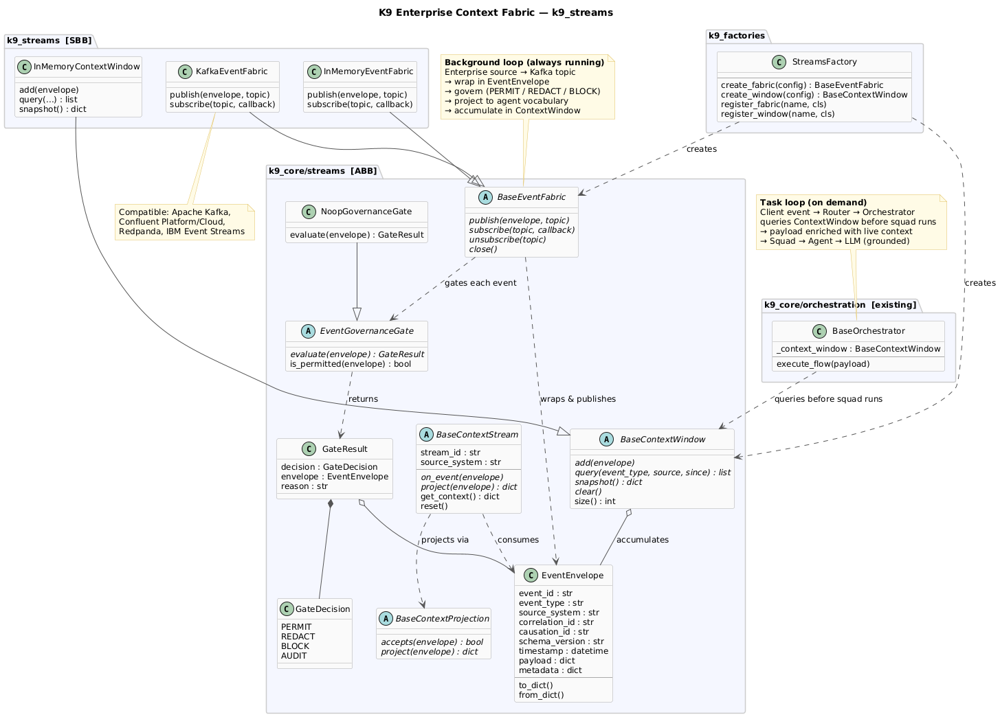

**Date:** 2026-06-05
**Author:** Ravi Natarajan

---

## K9 Enterprise Context Fabric — k9_streams

K9-AIF Phase 1 of `k9_streams` introduces the **K9 Enterprise Context Fabric** — a governed transport layer that continuously streams enterprise context into agentic flows.

The core principle:

> IBM Confluent, Kafka, Redpanda, and IBM Event Streams are SBBs.
> K9-AIF defines how agentic flows consume, govern, and reason over what they stream.

---

## Two Loops, One Framework

The architecture separates two completely independent processes:

```
─────────────────────────────────────────────────────
BACKGROUND  (always running, continuous)

  Enterprise System → Kafka topic
        │
        ▼
  KafkaEventFabric
        │  wraps in EventEnvelope
        ▼
  EventGovernanceGate
        │  PERMIT / REDACT / BLOCK / AUDIT
        ▼
  BaseContextProjection
        │  source schema → agent vocabulary
        ▼
  BaseContextWindow  ← silently accumulating governed context

─────────────────────────────────────────────────────
FOREGROUND  (triggered on demand)

  Client event → Router → Orchestrator
                               │
                               │  queries ContextWindow
                               ▼
                           Squad → Agent → LLM
                           (grounded in live enterprise state)
─────────────────────────────────────────────────────
```

The streaming and governance are done **before** any agent task arrives. When the Orchestrator picks up a task, the context window is already populated. The agent does not wait for streams — it queries what is already there.

This is the difference between an LLM assistant and an enterprise cognitive agent.

---

## The Architecture

<a href="../assets/images/blogs/k9_streams_architecture.png" target="_blank">

</a>

---

## ABB Contracts (k9_core/streams/)

Every ABB is provider-agnostic. Confluent, Redpanda, and IBM Event Streams are all SBBs of the same contract.

**`EventEnvelope`** — every enterprise event, regardless of source, is wrapped in a standard envelope before anything else in the framework sees it:

```python
@dataclass
class EventEnvelope:
    event_type:     str        # "sap.policy.updated"
    source_system:  str        # "sap"
    payload:        dict       # raw event data
    event_id:       str        # UUID auto-generated
    correlation_id: str        # links related events
    causation_id:   str        # parent event — causal chain
    timestamp:      datetime
    metadata:       dict       # sensitivity, tenant, routing hints
```

**`BaseEventFabric`** — transport contract. Implementations handle IBM Confluent, Kafka, in-memory, or any streaming provider:

```python
class BaseEventFabric(ABC):
    def publish(self, envelope: EventEnvelope, topic: str) -> None: ...
    def subscribe(self, topic: str, callback) -> None: ...
    def close(self) -> None: ...
```

**`EventGovernanceGate`** — every event passes through a governance gate before reaching agents. Four outcomes:

| Decision | Meaning |
|---|---|
| `PERMIT` | Event passes unchanged |
| `REDACT` | Sensitive fields removed, then forwarded |
| `BLOCK` | Stopped here — agents never see it |
| `AUDIT` | Passes but flagged for compliance logging |

```python
class EventGovernanceGate(ABC):
    def evaluate(self, envelope: EventEnvelope) -> GateResult: ...
```

**`BaseContextProjection`** — transforms source-system schema into agent vocabulary. Agents speak domain terms, not SAP IDoc formats:

```python
class BaseContextProjection(ABC):
    def accepts(self, envelope: EventEnvelope) -> bool: ...
    def project(self, envelope: EventEnvelope) -> dict: ...
```

**`BaseContextWindow`** — temporal memory. Not just the latest event — the sequence of events leading to the current state:

```python
class BaseContextWindow(ABC):
    def add(self, envelope: EventEnvelope) -> None: ...
    def query(self, event_type=None, source=None, since=None) -> list: ...
    def snapshot(self) -> dict: ...
```

---

## SBB Implementations (k9_streams/)

| SBB | Provider | Notes |
|---|---|---|
| `InMemoryEventFabric` | None | Local dev/test — zero Kafka needed |
| `KafkaEventFabric` | **IBM Confluent** / Apache Kafka / Redpanda / IBM Event Streams | `pip install k9-aif[kafka]` |
| `InMemoryContextWindow` | None | Thread-safe sliding window, local testing |

---

## Zero Impact on Existing Code

Streams are disabled by default. Existing Routers, Orchestrators, Agents, and Squads are completely unaffected:

```yaml
# config.yaml
streams:
  enabled: false   # default — opt in to enable
```

When enabled:

```yaml
streams:
  enabled: true
  provider: kafka
  kafka:
    bootstrap_servers: "${KAFKA_BOOTSTRAP_SERVERS:-localhost:9092}"
  window:
    max_events: 500
```

The `StreamsFactory` returns `None` when disabled. Every hook in the Orchestrator is null-guarded.

---

## What This Enables

**Before k9_streams:**
A ClaimsAgent receives a `policy_id`. It calls the LLM with static data from the request.

**With k9_streams:**
1. A SAP CDC stream continuously feeds policy change events into the context window
2. When a claims task arrives, the Orchestrator queries: *"what changed on this policy in the last 24 hours?"*
3. The live delta is injected into the payload before the squad runs
4. The LLM reasons over current enterprise state, not static context

The LLM is the same. The difference is what it knows when it answers.

---

## What's Next — Phase 2

- Wire `BaseContextWindow` into `BaseOrchestrator` (optional, null-safe)
- `K9EventGovernanceGate` — OOB gate with PII detection and sensitivity classification
- Reference example: EOC insurance claim enriched from a live SAP policy stream
- `K9ContextStreamAgent` — an agent that can query the window directly within `execute()`

---

## Summary

| | |
|---|---|
| **EventEnvelope** | Universal wrapper — correlation, causation, source, schema |
| **EventGovernanceGate** | Govern at the data boundary — not inside the agent |
| **BaseContextProjection** | Source schema → agent vocabulary |
| **BaseContextWindow** | Temporal memory — the sequence, not just the state |
| **KafkaEventFabric** | Confluent / Redpanda / IBM Event Streams as SBBs |
| **InMemoryEventFabric** | Local testing, zero dependencies |
| **StreamsFactory** | Disabled by default — zero impact on existing code |

K9-AIF now has the architectural layer that answers the hardest question in enterprise agentic AI: how do agents know what is true right now?

---

*K9-AIF is open source. Framework source on [GitHub](https://github.com/k9aif/k9-aif-framework). Docs at [pydocs.k9x.ai](https://pydocs.k9x.ai).*
