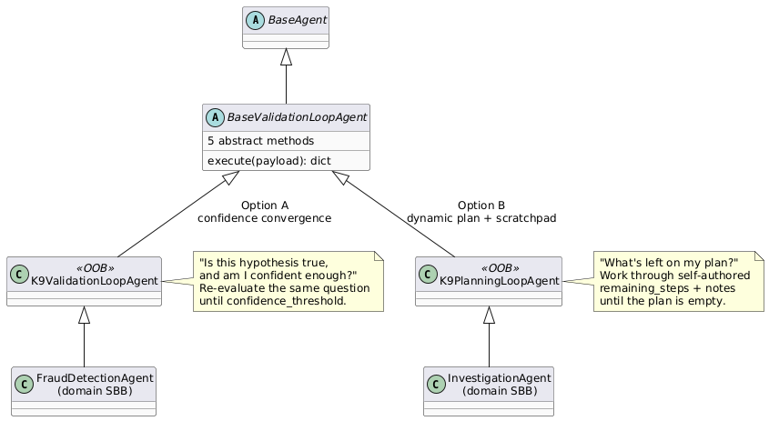

Reading [this piece on Building Deep Agents](https://abvijaykumar.medium.com/building-deep-agents-5d2f77394c3b) is what got this thought process going: agents that plan, remember, delegate, and grind through long tasks on their own — how does that line up against K9-AIF? Does the framework already support this, or is there a real gap?

Short answer: mostly yes. Walking through it pillar by pillar, K9-AIF's ABB/SBB architecture already covers most of what "Deep Agent" describes. One piece was genuinely missing — dynamic, self-revising planning — so I added a new class to close it: `K9PlanningLoopAgent`, shipped today.

Here's the walkthrough: what a Deep Agent is, a quick refresher on K9-AIF's ABB/SBB model, and then how the two map onto each other.

---

## What Is a "Deep Agent"?

LangChain's `deepagents` package names a pattern for keeping a single agent productive over long, open-ended tasks — the kind of work that would otherwise blow out the context window or wander off-task. It rests on four pillars:

| # | Pillar | What it does |
|---|---|---|
| 1 | **Detailed system prompt** | A long, carefully structured prompt establishes role, constraints, and operating procedure up front |
| 2 | **Planning tool** | The LLM maintains an explicit todo list — writes it, checks items off, revises it as it learns more |
| 3 | **Sub-agent spawning with context isolation** | Work gets delegated to sub-agents that run in a *clean* context and report back only a summary — keeps the parent's context from filling with sub-agent noise |
| 4 | **Virtual filesystem** | The agent reads/writes scratch files — working memory that persists across steps without living in the prompt |

Useful less as "code to adopt," more as a checklist: does an agent already have an equivalent for each pillar, or is there a real gap?

---

## K9-AIF, Briefly: ABB and SBB

K9-AIF's architecture is built around two layers:

- **Architecture Building Blocks (ABB)** — abstract classes that define a contract: the interface, the lifecycle, the loop skeleton. No domain logic lives here. `BaseAgent`, `BaseValidationLoopAgent`.
- **Solution Building Blocks (SBB)** — concrete implementations. For specific ABBs, K9-AIF ships ready-to-run, out-of-the-box (OOB) defaults (`K9ValidationLoopAgent`, `K9ModelRouter`, …) — extend and override only what your domain needs. Domain-specific agents (`FraudDetectionAgent`, `DocumentExtractorAgent`) are SBBs too, usually built on the OOB rather than the raw ABB.

```
BaseAgent (ABB)
  └── BaseValidationLoopAgent (ABB — loop skeleton)
        └── K9ValidationLoopAgent (OOB — ready-to-run default)
              └── FraudDetectionAgent (SBB — domain-specific)
```

Having said this, let's see how the four Deep Agent pillars map onto this model.

---

## Mapping the Four Pillars to K9-AIF

| # | Pillar | K9-AIF equivalent | Verdict |
|---|---|---|---|
| 1 | Detailed system prompt | `role` / `goal` fields in agent YAML (Skill 1, every `BaseAgent`) — declarative, not hand-rolled per agent | **Already covered** |
| 2 | Planning tool (todo list) | *(nothing — until today)* | **Real gap → closed by `K9PlanningLoopAgent`** |
| 3 | Sub-agent context isolation | `K9AgentSpawner` / `ChildAgent` exists for parallel decomposition — but does **not** isolate context from the parent's reasoning chain | **Deliberately different** (see below) |
| 4 | Virtual filesystem / memory | `notes: dict` scratchpad in `ValidationLoopContext`, persisted via `models/` to the routing state store / Neo4j | **Adopted, in lightweight form** |

Three of four were either already covered or a conscious "different by design." Planning was the one real gap.

---

## Closing the Planning Gap: `K9PlanningLoopAgent`

K9-AIF already had an iterative-reasoning ABB: `BaseValidationLoopAgent`, with `K9ValidationLoopAgent` as its OOB implementation. So why a new class instead of extending that one?

**`K9ValidationLoopAgent` answers one question repeatedly:** *"Is this hypothesis true, and am I confident enough?"* Each iteration re-evaluates the *same* assessment with the growing history of prior attempts as context. It converges on a single confidence score.

**`K9PlanningLoopAgent` (new) works through a self-authored, revisable plan** — the planning-tool pillar. Each iteration may tackle a *different* sub-task, drawn from a `remaining_steps` list the LLM maintains and updates every round, plus a `notes` scratchpad carried forward. The loop finalizes when the plan is empty (`plan_complete`) — confidence is a secondary/fallback signal, not the primary one.

Same loop skeleton (`execute()`, the five abstract methods, `ValidationDisposition`), different "brain":

| Method | `K9ValidationLoopAgent` | `K9PlanningLoopAgent` |
|---|---|---|
| `generate_hypothesis` | Prompt = role + goal + payload + prior iterations | Same, **plus current plan + scratchpad** |
| `evaluate_observation` | Parse `{conclusion, confidence, reasoning, needs_more}` | Parse `{..., remaining_steps, notes}`; **writes them back onto the loop context** |
| `should_continue` | `FINALIZE` when `confidence ≥ threshold` | `FINALIZE` when **plan is empty** *or* `confidence ≥ threshold` |

Both extend `BaseValidationLoopAgent` directly as siblings — additive, nothing existing changed.

---

## Why K9-AIF Doesn't Isolate Sub-Agent Context

The Deep Agent pattern isolates sub-agents on purpose: clean context in, summary out. That keeps the parent's context window from filling with a sub-agent's exploratory noise.

K9-AIF's `BaseSquad` does close to the opposite, on purpose: each agent in a flow enriches the *same* shared context. By the time `AuditAgent` runs, it can see the triage agent's reasoning, the fraud agent's findings, and the adjudication agent's conclusion — not a one-line summary of each.

That full trail is the point. "We approved this claim because Triage flagged X, FraudDetection found Y, Adjudication weighed Z — and here's the reasoning behind each" is the answer an audit needs verbatim. A summarized sub-agent report can't reconstruct that; full shared context can.

`K9AgentSpawner` / `ChildAgent` *is* isolated — for parallel work, no shared mutable state, no race conditions — but that's solving concurrency safety, not "keep context off the audit trail." Two different problems; K9-AIF already has an ABB for each, and isolating one didn't require isolating the other.

---

## Class Diagram — Two Ways an SBB Can Extend

The high-level shape: one ABB skeleton, two OOB "brains," and the SA picks per-agent which one a Solution Building Block extends.

<a href="../assets/images/blogs/k9-aif-deep-agent-extension-options.png" target="_blank">
  
</a>

---

## Solutions Architect Decision Table

The "which ABB does this agent extend" decision now has three rows:

| Question | Extend |
|---|---|
| Produces its answer in one pass | `BaseAgent` |
| Tests a hypothesis, re-evaluates until confident | `K9ValidationLoopAgent` |
| Works through an open-ended, multi-step task | `K9PlanningLoopAgent` |

| One-pass | Iterative confidence convergence | Open-ended dynamic planning |
|---|---|---|
| Triage, routing, audit, guard, graph sync | Fraud signal correlation, claims evidence, compliance gap, document confidence | Investigation, multi-step research, open-ended remediation |

Same rule as always: this is an **explicit SA design-time decision per agent**, not an automatic upgrade. Most agents in most squads should still be plain `BaseAgent`.

---

## Status

`K9PlanningLoopAgent` is implemented and tested:

- `k9_aif_abb/k9_agents/planning/k9_planning_loop_agent.py` — new OOB, ~230 lines
- `k9_aif_abb/k9_agents/validation/models/validation_loop.py` — additive `remaining_steps` / `notes` fields on `ValidationLoopContext` and `ValidationLoopResult`
- `k9_aif_abb/tests/test_k9_planning_loop_agent.py` — 10 new tests, fully offline (LLM mocked)
- Full suite: 219/220 pass (the 1 failure is a pre-existing live-Ollama smoke test, unrelated)
- `SKILLS.md` Skill 10 — updated hierarchy and the three-way SA decision table above

---

## While I Was At It — `AGENT.md`

A related question came up around the same time: do we need an `AGENT.md`?

`AGENT.md` (and its sibling `AGENTS.md`) is a convention some tools use for "how should an AI coding assistant behave in this repo" — build commands, conventions, do's and don'ts. K9-AIF already has this, split across `CLAUDE.md` (root-level guidance: pre-push checklist, hooks, commands, architecture map) and `SKILLS.md` (the pattern catalog: every ABB, the Skill recipes, decision tables for SAs).

Both were deliberately written as **LLM-agnostic context files** — no Claude-specific assumptions. Any coding assistant looking for a generic instructions file is reading the same content `CLAUDE.md` already provides. Adding `AGENT.md` would mean either duplicating the content (and the two drift apart over time) or making it a one-line pointer (a hop, no new information). Single source of truth wins. If a specific tool *hard-requires* the exact filename, a one-line redirect is cheap — but that's a tooling accommodation, not an architecture decision.

---

## Takeaway

Most of "Deep Agent" was already in K9-AIF, under different names — `role`/`goal` is the system prompt, the squad's shared context is the working memory, `K9AgentSpawner` is the sub-agent mechanism. One piece was a genuine gap, and it's closed now: `K9PlanningLoopAgent` gives agents a self-revising plan and scratchpad, the same way `K9ValidationLoopAgent` gives them confidence-driven convergence. Two OOB "brains," one ABB skeleton, and the SA picks per agent — that's the architecture, and it's additive all the way down.

---

*`K9PlanningLoopAgent` and `K9ValidationLoopAgent` are available in `k9_aif_abb/k9_agents/`. The full usage guide is in [SKILLS.md](https://github.com/k9aif/k9-aif-framework/blob/main/SKILLS.md). The framework is open source at [github.com/k9aif/k9-aif-framework](https://github.com/k9aif/k9-aif-framework).*
