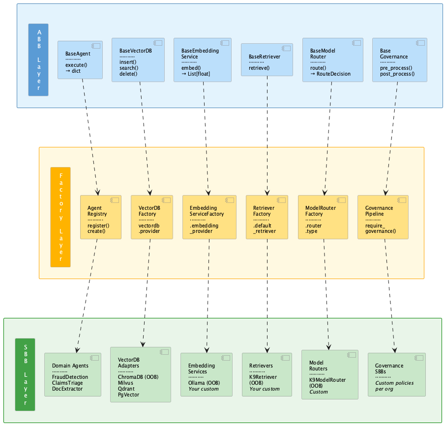

## The Power of Abstraction

> "The entire history of software engineering is one of rising levels of abstraction. This is as it was, is now, and always shall be." — Grady Booch

I first encountered Object-Oriented Analysis and Design in the early 1990s. Inheritance, multiple inheritance, dynamic binding, polymorphism — these were not textbook concepts to me. They were tools that made software *beautiful*. You could write something that held its shape under change. You could build a system where adding a new capability didn't require rewriting what already worked. Over thirty-plus years in software engineering, that idea — that abstraction is the mechanism by which software survives change — has guided how I think about every system I design.

Abstraction is not about hiding complexity. It is about drawing the right lines — the lines that hold when requirements change, when providers change, when teams change, when the enterprise scales.

A well-defined abstract class is a contract. It says: "Here is what you must provide. Here is what I guarantee. Everything else is your business." When that contract is right — when it captures the essential interface without leaking implementation details — you can swap the concrete implementation without touching the caller. You can add a new implementation without modifying the framework. You can test the contract independent of any specific provider.

This is Liskov. This is the Open-Closed Principle. This is what every Enterprise Architect and AI Architect learned — or should have learned — before they ever touched an LLM.

---

## What Is Happening in the Agentic AI Space

Everyone is diving into agentic process flows. The LLM is the new hammer, and everything looks like a nail. Teams spin up agents, wire them together, call an LLM, get a result, call it a POC — and declare success.

But look under the hood. What's actually there?

One big monolithic script. Hardcoded provider calls. No separation between the workflow and the infrastructure. No contracts. No abstraction boundaries. No governance. The prompt, the model selection, the data retrieval, the orchestration logic — all tangled together in a single file, written by an LLM that was told "make this work," not "make this last."

And it does work. For that one demo. For that one model. For that one use case.

Then someone asks: "Can we swap Ollama for Watsonx?" And the answer is: rewrite everything. "Can we add a governance check before the LLM call?" Rewrite everything. "Can another team reuse this agent in a different flow?" They can't. The agent doesn't know where its own logic ends and the orchestration begins.

This is not engineering. This is prototyping without discipline — and it is dangerous, because these POCs get promoted as production-ready, and the technical debt they carry is invisible until it's too late.

I've seen this pattern before. In the 90s, it was procedural code masquerading as object-oriented because someone put it in a class. In the 2000s, it was monolithic services with REST endpoints bolted on and called "microservices." Now, in 2026, it's monolithic LLM scripts called "agentic frameworks."

The technology changes. The mistake doesn't.

---

## ABB and SBB — TOGAF Applied to Agentic AI

K9-AIF's architecture is built on a separation that comes directly from TOGAF:

**Architecture Building Blocks (ABB)** — abstract contracts. They define the interface, the lifecycle, the governance hooks. They never contain domain logic. They live in `k9_core/`.

**Solution Building Blocks (SBB)** — concrete implementations. They extend ABBs with real behavior — domain-specific, provider-specific, organization-specific.

The framework ships OOB (out-of-the-box) SBBs — ready-to-run defaults that work with zero configuration. You don't have to write an embedding service to use vector retrieval. But when your organization needs a different provider, you extend the ABB, register your SBB, set one config key — and the framework doesn't change.

<a href="../assets/images/blogs/k9-aif-abb-sbb-swimlane.png" target="_blank">
  
</a>

---

## The Swim Lane — ABB on Top, SBB Below

The ABB defines the contract. The SBB fulfills it. The factory wires them together from config. The solution code never touches the ABB — it extends the SBB or uses the factory.

```
┌─────────────────────────────────────────────────────────────────────┐
│  ABB Layer (Abstract Contracts — k9_core/)                         │
│                                                                     │
│  BaseEmbeddingService    BaseVectorDB    BaseRetriever    BaseAgent │
│       │                       │               │               │     │
│       │  embed()              │  search()     │  retrieve()   │     │
│       │  embed_batch()        │  insert()     │               │     │
│       │                       │  delete()     │               │     │
├───────┼───────────────────────┼───────────────┼───────────────┼─────┤
│       │     Factory Layer     │               │               │     │
│       │                       │               │               │     │
│  EmbeddingService        VectorDB       Retriever        Agent      │
│    Factory                Factory        Factory        Registry    │
│       │                       │               │               │     │
│       │   config.yaml         │               │               │     │
│       │   drives selection    │               │               │     │
├───────┼───────────────────────┼───────────────┼───────────────┼─────┤
│  SBB Layer (Concrete Implementations)                               │
│                                                                     │
│  OllamaEmbedding     ChromaDBAdapter   K9Retriever    FraudAgent   │
│  Service (OOB)       (OOB default)     (OOB)         (Domain SBB)  │
│                                                                     │
│  [Your custom        MilvusAdapter     [Your custom   ClaimsAgent  │
│   embedding SBB]     QdrantAdapter      retriever]    (Domain SBB)  │
│                      PgVectorAdapter                                │
│                                                                     │
└─────────────────────────────────────────────────────────────────────┘
```

The arrows only go **down**. ABBs don't know which SBB will fulfill them. Factories don't know which provider is configured until runtime. SBBs extend upward — but never modify the layer above.

---

## How the ABB Contract Works — A Concrete Example

Here is the entire ABB contract for the embedding service in K9-AIF:

```python
class BaseEmbeddingService(ABC):

    def __init__(self, config=None):
        self.config = config or {}

    @abstractmethod
    def embed(self, text: str) -> List[float]:
        raise NotImplementedError

    def embed_batch(self, texts: List[str]) -> List[List[float]]:
        return [self.embed(t) for t in texts]
```

Twelve lines. That contract is stable. Every embedding provider — Ollama, OpenAI, Watsonx, a custom on-premise model — implements `embed()`, registers with the factory, and the entire framework works without a single line of change.

The OOB SBB for Ollama:

```python
class OllamaEmbeddingService(BaseEmbeddingService):

    def __init__(self, config=None):
        super().__init__(config)
        self._client = None
        vdb_cfg = self.config.get("vectordb", {})
        self._model = vdb_cfg.get("embedding_model", "nomic-embed-text")
        self._host = vdb_cfg.get("embedding_endpoint", "http://localhost:11434")

    def embed(self, text: str) -> List[float]:
        self._ensure_client()
        result = self._client.embeddings(model=self._model, prompt=text)
        return result.get("embedding", [])
```

An enterprise team that uses Watsonx writes their own `WatsonxEmbeddingService`, registers it with the factory, sets `vectordb.embedding_provider: watsonx` in their config.yaml — and the framework, the squad flow, the agents, the retriever — none of them know or care.

An SBB team switches from ChromaDB to Milvus by changing one line in their config:

```yaml
vectordb:
  provider: milvus
```

No code changes. No rewrite. No touching the agents, the squads, the orchestrators, or the retriever. That is what abstraction buys you.

---

## Consistency Across the Enterprise

When three teams in three business units build agentic applications on K9-AIF, they share the same ABB contracts. Their agents implement the same `execute(payload) -> dict`. Their squads run the same flow engine. Their governance follows the same pipeline.

But their SBBs are entirely their own.

| What stays the same (ABB) | What varies (SBB) |
|---|---|
| `BaseAgent.execute()` contract | Domain logic inside `execute()` |
| `BaseVectorDB.search()` interface | ChromaDB, Milvus, Qdrant, PgVector |
| `BaseEmbeddingService.embed()` interface | Ollama, OpenAI, Watsonx |
| Squad flow engine + `context_keys` | Which agents, what flow, what scoping |
| Governance pipeline hooks | What gets checked, what gets blocked |
| `K9ModelRouter` scoring | Custom routers with different scoring signals |

Code developed across projects, across business units, across the enterprise remains **consistent**. Every team follows the same contracts. Every agent is testable the same way. Every infrastructure concern is swappable the same way. A developer who learns the pattern on one project applies it immediately on the next.

This is what OOA, OOD, and the discipline of patterns give you. Not theoretical elegance — practical survival.

---

## The Discipline Behind Every Feature

Every capability in K9-AIF follows the same pattern:

```
k9_core/<concern>/base_<concern>.py       ← ABB contract (abstract)
k9_<concern>/<impl>/<name>_service.py     ← SBB implementation (concrete)
k9_factories/<concern>_factory.py         ← Config-driven wiring
config.yaml                               ← Provider selection at deployment
```

This pattern now covers nine concerns — and growing:

| Concern | ABB | OOB SBB | Factory |
|---|---|---|---|
| Inference | `BaseLLM` | `OllamaLLM`, `OpenAILLM` | `LLMFactory` |
| Model Routing | `BaseModelRouter` | `K9ModelRouter` | `ModelRouterFactory` |
| Embedding | `BaseEmbeddingService` | `OllamaEmbeddingService` | `EmbeddingServiceFactory` |
| Vector Store | `BaseVectorDB` | `ChromaDBAdapter` | `VectorDBFactory` |
| Retrieval | `BaseRetriever` | `K9Retriever` | `RetrieverFactory` |
| Cache | `BaseCache` | `InMemoryAdapter` | `CacheFactory` |
| Secret Management | `BaseSecretManager` | `EnvSecretAdapter` | `SecretManagerFactory` |
| Agent | `BaseAgent` | `K9ValidationLoopAgent` | `AgentRegistry` |
| Governance | `BaseGovernance` | `NoopGovernance` | `require_governance()` |

When the tenth concern comes — and it will — it follows the same structure. It will not break the other nine. That guarantee is not a hope. It is an architectural property that comes from doing OOA and OOD correctly.

---

## A Message to Enterprise Architects and AI Architects

Let me be direct about something.

OOA is not outdated. OOD is not outdated. UML is not outdated. Design Patterns are not outdated. In fact, they are the solid foundation for any successful software design and development. They always have been.

The industry has a short memory. Every new technology wave brings voices that say the old disciplines no longer apply — that the new tool is so transformative it renders architecture thinking unnecessary. It happened with web development. It happened with cloud. It is happening now with generative AI and agentic flows.

It is wrong every time.

If you learned OOA and OOD — use it. Do not abandon thirty years of software engineering discipline because the LLM made the code compile on the first try. Compilation is not architecture. A working demo is not a production system. And a monolithic script that calls an LLM is not an agentic framework.

Abstraction is important. Building modularized code that complies with a contract is vital. Configuration-driven provider selection is not over-engineering — it is the mechanism that lets your system survive the next provider change, the next team handoff, the next compliance requirement.

Inheritance, polymorphism, the factory pattern, the adapter pattern, the open-closed principle — these are not relics of the 90s. They are the reason some systems last and others are rewritten every eighteen months. They are the foundation on which K9-AIF stands, and they are the foundation on which every serious agentic system should be built.

Booch said it thirty years ago. It is still true.

> "The entire history of software engineering is one of rising levels of abstraction."

Do not forget the fundamentals. They are what make this work.

Architecture first — built to last.

---
