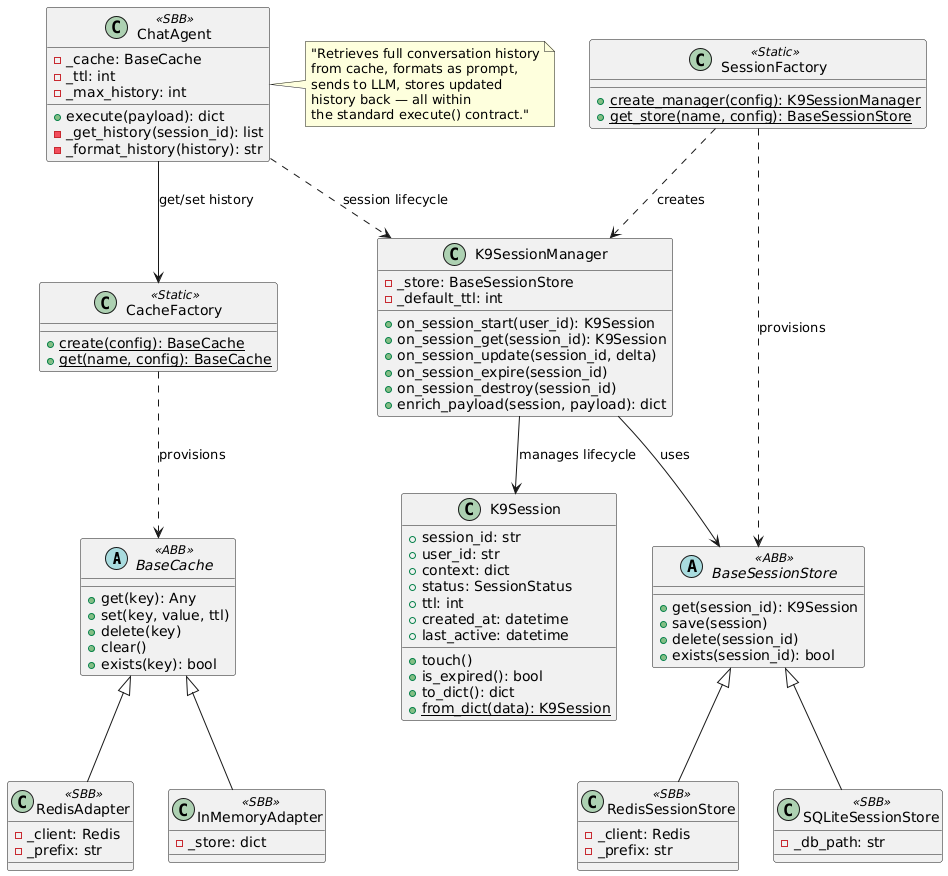

## Session Management & Redis in Agentic Chat

Last night I was looking at the K9-AIF framework's ABB inventory — `BaseCache` with `RedisAdapter`, `K9SessionManager`, `SessionFactory`, `RedisSessionStore` — all production-ready, config-driven, sitting right there in the framework. And I thought: why not use these components to build a proper multi-turn chat example?

We already have `k9chat` — it was created initially to demonstrate `LLMFactory` and `K9ModelRouter`, showing how agents invoke LLMs through the framework's inference pipeline. It does that well. But it is single-turn. Each message starts from zero. The framework has grown since then — session management, Redis-backed caching, TTL lifecycle — and the chat example had not caught up.

So I enhanced it. Added session management using the framework's own ABBs. And in doing so, I realized this is worth writing about — because every team building on LLM APIs will face the same problem.

Here is what happens without session management:

```
Customer:  I need to return order #8847. The item arrived damaged.
Bot:       I've located order #8847 — a hydraulic valve assembly shipped
           on June 12. I can initiate a return. Refund or replacement?

Customer:  Refund please.
Bot:       I'd be happy to help with a refund. Could you provide your
           order number?
```

The bot forgot. One turn later, the order number, the item, the context — gone. In a support center, that is a failed interaction. In a governed enterprise pipeline — defense acquisition, insurance claims, compliance review — it is a broken process.

This is not a model problem. The model is perfectly capable of maintaining a coherent conversation. It is an **application architecture problem** — and the framework already has the solution. We just had not wired it into the example.

So I did. This post walks through why the problem exists, why the naive fix does not scale, and how K9-AIF's session infrastructure solves it — using real code from the framework.

---

## The Root Cause: LLM APIs Are Stateless by Design

Every major LLM provider — Anthropic Claude, OpenAI, IBM watsonx, Ollama, xAI — operates the same way: each API call is independent. The model receives a prompt, produces a response, and forgets everything. There is no server-side session. No message history. No memory.

The chat UI's continuity is an illusion that the application must stitch together.

To hold a multi-turn conversation, the application must:

1. Maintain the full list of all messages exchanged so far
2. Send that entire list with every follow-up request

The model only knows what is in the current request. If the application does not include the prior conversation, the model has no context. "And 3 more?" becomes a meaningless fragment. "Refund please" has no order to refund.

---

## The Naive Fix — and Why It Breaks

The first instinct is simple: keep a Python list in memory.

```python
history = []

def chat(user_message):
    history.append({"role": "user", "content": user_message})
    prompt = format_history(history)
    response = llm.generate(prompt)
    history.append({"role": "assistant", "content": response})
    return response
```

This works — for one process, on one machine, until it restarts. The moment any of these happen, the conversation is lost:

- The server restarts (deployment, crash, scaling event)
- A second instance handles the next request (load balancer)
- The user returns after the process recycles

In-memory state does not survive process boundaries. It is not shared across instances. It is not durable. For a demo, it is fine. For production, it is a liability.

---

## The K9-AIF Solution: Governed Session State as Infrastructure

K9-AIF treats session management as an **infrastructure concern** — not something each application team reinvents. The framework provides three layers that work together:

**`K9Session`** — the session data model. Holds `session_id`, `user_id`, `context` (a dict that accumulates conversation state), `status`, `ttl`, and timestamps. Auto-generates a UUID on creation.

**`K9SessionManager`** — the lifecycle orchestrator. Handles `on_session_start()`, `on_session_get()`, `on_session_update()`, `on_session_expire()`, and `on_session_destroy()`. Enforces TTL expiry. Enriches payloads with session context before they reach agents.

**`SessionFactory`** — config-driven factory that provisions the storage backend. Redis for distributed production. SQLite for single-node. In-memory for tests. Switch via one config line — no code changes.

<a href="../assets/images/blogs/k9-session-management-class-diagram.png" target="_blank">
  
</a>

The class diagram captures the full hierarchy: ABB contracts at the top (`BaseCache`, `BaseSessionStore`, `K9Session`, `K9SessionManager`), SBB adapters that implement them (`RedisAdapter`, `RedisSessionStore`, `SQLiteSessionStore`), and the application's `ChatAgent` that consumes the infrastructure without knowing which backend is active. Factories provision everything from config.

---

## Before and After

**Before — stateless, broken:**

```python
class ChatAgent(BaseAgent):
    def execute(self, payload):
        prompt = payload["message"]             # no history
        resp = llm_invoke(self.config, InferenceRequest(prompt=prompt))
        return {"response": resp.output}        # context lost
```

Every turn starts from zero. The model has no idea what came before.

**After — session-aware, durable:**

```python
class ChatAgent(BaseAgent):
    def __init__(self, config=None, **kwargs):
        super().__init__(config or {}, **kwargs)
        self._cache = CacheFactory.create(self.config)  # Redis or in-memory
        self._ttl = self.config.get("chat", {}).get("ttl_seconds", 3600)
        self._max_history = self.config.get("chat", {}).get("max_history", 50)

    def execute(self, payload):
        session_id = payload.get("session_id", "default")
        user_message = payload["message"]

        # Retrieve full conversation history
        history = json.loads(self._cache.get(f"chat:{session_id}") or "[]")
        history.append({"role": "user", "content": user_message})

        # Send entire history to LLM
        prompt = self._format_history(history)
        resp = llm_invoke(self.config, InferenceRequest(
            prompt=prompt, task_type="chat",
        ))

        # Persist updated history back to Redis
        history.append({"role": "assistant", "content": resp.output})
        if len(history) > self._max_history:
            history = history[-self._max_history:]
        self._cache.set(f"chat:{session_id}", json.dumps(history), ttl=self._ttl)

        return {"response": resp.output, "session_id": session_id}
```

The agent retrieves the full history from Redis, includes it in the prompt, and stores the updated history back — all within the standard `execute()` contract. No special infrastructure code in the application. `CacheFactory.create()` reads the config and provisions the right backend.

---

## Configuration — One Line to Switch Backends

```yaml
# Redis — production (distributed, TTL-aware, survives restarts)
cache:
  provider: redis
  redis_host: "${REDIS_HOST:-localhost}"
  redis_port: 6379
  key_prefix: "k9chat:"

chat:
  session_enabled: true      # default: true — session management is ON by default
  ttl_seconds: 3600
  max_history: 50
```

`session_enabled` defaults to `true` — for any chat application, maintaining conversation context is expected behavior, not an opt-in. Set it to `false` only for stateless single-turn use cases (e.g., one-shot classification or extraction agents that do not need history).

Switch to in-memory for development:

```yaml
cache:
  provider: in_memory
```

No code changes. The `ChatAgent` calls `CacheFactory.create(self.config)` either way. The factory reads `cache.provider` and returns the right adapter.

For compliance scenarios where chat history must be auditable and persistent beyond TTL, use the `K9SessionManager` with `RedisSessionStore` or `SQLiteSessionStore` — the session is stored with full metadata including timestamps, user identity, and status lifecycle.

---

## Why This Belongs in the Framework

Every team building a chat application on LLM APIs will face this problem. Without a framework, each team writes their own session layer — different storage choices, different TTL logic, different serialization formats, different failure modes. Multiply that across ten teams in an enterprise and you have ten incompatible session implementations, none of them governed, none of them auditable.

K9-AIF's position is clear: **conversation memory is application infrastructure, not application logic.** It belongs in the framework — config-driven, backend-agnostic, governed by the same lifecycle as every other ABB.

The `BaseCache` contract has four methods: `get`, `set`, `delete`, `clear`. The `BaseSessionStore` contract has three: `get`, `save`, `delete`. The `K9SessionManager` handles lifecycle — start, touch, expire, destroy. The factories provision the right backend from config.

The application team writes one thing: how to format the conversation history into a prompt. Everything else — storage, TTL, serialization, expiry, multi-instance sharing — is infrastructure that the framework handles.

---

## Takeaway

LLM APIs are stateless. Conversation memory lives in your application layer — or it does not live at all.

K9-AIF makes that layer durable (Redis), scalable (shared across instances), governed (TTL, expiry, lifecycle management), and config-driven (swap backends without code changes).

The model does not remember. Your framework must.

---

*K9-AIF is an open-source framework for building governed agentic AI applications. [Framework documentation](https://pydocs.k9x.ai/starthere/) | [k9x.ai](https://k9x.ai)*