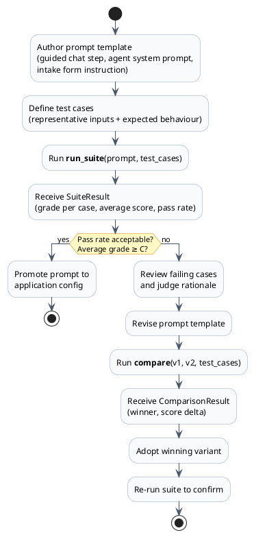
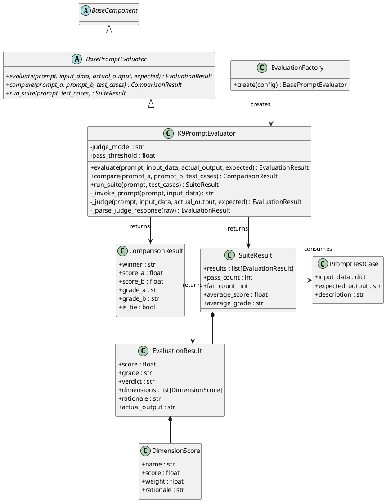

I was working through the Anthropic Claude course and upon reading about Prompt Evaluation, I stopped at a specific passage. It described three options engineers use when they need to know if a prompt is working. Option 1: gut feel. Option 2: a few manual test cases. Option 3: systematic evaluation with objective scoring. And it said — plainly — that options 1 and 2 are traps that all engineers fall into, including the people who wrote the course.

> "It's natural to write a prompt for a serious application and not test it thoroughly enough. We tend to test with inputs that seem obvious to us, but real users will interact with your prompts in ways you never anticipated."

I set the course down and thought about K9-AIF.

I had built a framework with squads, agents, model routing, governance, validation loops, object storage, Kafka pipelines. I had built patterns that hold — ABB contracts, SBB implementations, factories. But when I asked the honest question — *does the framework provide the capability to evaluate a prompt before executing it, and grade it?* — the answer was no. The ABBs were there to run prompts. Not to measure them.

Before going further, let me be precise about what "prompt evaluation" means in this context and where it fits in the K9-AIF architecture — because it does *not* go where you might expect.

K9-AIF squads and agents already have a quality gate for runtime workflows: the `K9ValidationLoopAgent`. When an agent produces output in a pipeline, the validation loop inspects it against domain rules, retries with corrective feedback on failure, and gates the workflow. That is a runtime mechanism. It knows the domain. It enforces output correctness in context.

`BasePromptEvaluator` solves a different problem. It is a **prompt engineering tool**. It answers the question you ask *before* you deploy a prompt inside an agent — and again every time you change it: *how well does this prompt actually perform across a range of inputs?* It is a development-time and measurement-time tool. You use it to score, compare, and grade prompt variants. You use it to build confidence before a prompt reaches a workflow, not to gate the workflow itself.

Think of it this way: the validation loop is the runtime quality gate. The prompt evaluator is the engineering bench you test on before the prompt ever reaches the gate.

With that scope clear, here is what was built.

---

## What Engineers Actually Do

Before I describe the solution, let me be honest about the problem.

When I build an agent, I write the prompt carefully. I test it with a few representative inputs — the ones I know matter. The response looks right. I move on.

That is option 2. It feels like diligence because I am writing test cases. But I am writing the test cases I already know the answer to. I am testing my assumptions, not my prompt.

Real users do not use your assumptions. They phrase questions differently. They bring context you didn't model. They ask follow-up questions that expose gaps in how your prompt handles ambiguity. A prompt that scores well on five handpicked cases can fail badly on the sixth case you never thought of — and you will only find out in production.

Systematic evaluation addresses this by running the prompt across a *range* of scenarios, scoring each result against defined dimensions, and giving you an objective aggregate. You get a number. That number tells you something the five handpicked tests could not.

More importantly, when you change the prompt — tighten the instructions, add context, change the model — you run the evaluation again. The delta is real signal. You know which version performs better, not because it feels better, but because the score changed.

---

## The Use Case: Authored Prompts in Guided Applications

Most production AI applications do not have free-form prompts. They have **authored prompts** — templates written by the development team and deployed as part of the application. A customer service portal guides users through a selection menu; each branch maps to a prompt template the developer wrote. An insurance intake form sequences the user through structured questions; each step calls the LLM with a pre-built instruction. A document processor runs each uploaded file through an extraction agent with a fixed system prompt.

The user never sees the prompt. The user sees the result. And the quality of that result depends entirely on the quality of the prompt the developer authored.

This is where prompt evaluation applies. Before you deploy a prompt template into a guided flow, you should know — objectively — how well it performs across the range of inputs it will encounter. Not just the happy path you tested manually. The ambiguous input. The edge case. The user who phrases it differently than you expected.

The developer workflow looks like this:



The loop is tight: author, test, grade, revise, compare, confirm. Every step is automated. The only human judgment is in reading the rationale — *why* did the judge score completeness at 55%? — and deciding how to improve the prompt.

When the model changes — an upgrade, a provider switch — you run the suite again. The score either holds or it does not. If it drops, you know before your users find out.

---

## Designing BasePromptEvaluator

I wanted the ABB to be simple and clean. Three operations:

1. **Evaluate one response** — given a prompt, the input data, the actual output the model produced, and an expectation, return an `EvaluationResult`
2. **Compare two prompts** — A/B test: given two prompt variants and a set of test cases, return a `ComparisonResult` showing which prompt wins and by how much
3. **Run a suite** — batch evaluation: given a prompt and a list of `PromptTestCase` objects, return a `SuiteResult` with aggregate pass rate and average score

That is the contract. Implementors provide the judge. The ABB specifies the shape.

The data model was equally deliberate:

- `EvaluationResult` carries a 0–100 score, a letter grade (A/B/C/D/F), a PASS/FAIL verdict, a list of `DimensionScore` objects, and a rationale string from the judge
- `DimensionScore` is one scored dimension — name, weight, score, and the judge's reasoning for that dimension
- `PromptTestCase` holds input data, expected output, and a description
- `ComparisonResult` names the winner and shows both scores
- `SuiteResult` aggregates: pass count, fail count, average score, average grade, and all individual results



---

## The OOB SBB: K9PromptEvaluator

The out-of-the-box implementation is `K9PromptEvaluator`. It uses LLM-as-judge — the same LLM infrastructure already in the framework, called twice per evaluation:

1. **Generation call** — `llm_invoke()` with `metadata["operation"] = "invoke"`: runs the prompt against the input data and gets the actual output
2. **Judge call** — `llm_invoke()` with `metadata["operation"] = "evaluate"`: sends the judge prompt to a reasoning model, which scores the output across five weighted dimensions

The judge prompt asks the model to score five dimensions and return structured JSON:

| Dimension         | Weight |
| ----------------- | ------ |
| Correctness       | 35%    |
| Completeness      | 25%    |
| Format compliance | 15%    |
| Clarity           | 15%    |
| Relevance         | 10%    |

Each dimension gets a 0–100 score and a brief rationale. The weighted composite becomes the final score. A score of 70 or above is PASS. Below 70 is FAIL.

The grade scale maps to the composite score: A (90+), B (80–89), C (70–79), D (60–69), F (below 60).

The operation metadata field matters here. When a squad or governance pipeline inspects LLM calls, it needs to distinguish between *inference calls* — the agent doing its job — and *evaluation calls* — the framework measuring the agent. Mixing the two in telemetry, tracing, or model routing would be wrong. Tagging by operation keeps them separate.

---

## Wiring It Into Config

The evaluation pipeline follows the same config-driven pattern as every other K9-AIF component. Nothing is hardcoded:

```yaml
evaluation:
  provider: k9
  pass_threshold: 70
  judge_model: reasoning
```

`EvaluationFactory.create(config)` reads the provider key and returns the right implementation. If you set `provider: my_custom_evaluator`, the factory resolves your SBB. The ABB contract guarantees the interface is identical.

The base URL for the LLM adapter resolves from `${OLLAMA_BASE_URL}` in the config — expanded at runtime from the `.env` file. No IP addresses in source code.

---

## Extending It

This is the point. The ABB is a contract. `K9PromptEvaluator` is one implementation — one that works out of the box, uses the framework's own LLM infrastructure, and requires no external dependencies.

A Solution Architect building on K9-AIF can extend this for their specific context. Examples of what that might look like:

- A **domain-calibrated evaluator** that replaces the generic judge dimensions with domain-specific rubrics — a legal document evaluator with dimensions like citation accuracy and regulatory completeness
- A **golden-set evaluator** that compares model output against a curated reference set using semantic similarity rather than LLM judgment
- A **multi-judge evaluator** that calls two different models as judges and resolves disagreements by majority or confidence weighting
- A **regression evaluator** that stores previous run scores in a database and flags regressions when a changed prompt scores more than N points lower on any dimension

All of these extend `BasePromptEvaluator`, implement the three abstract methods, and register with `EvaluationFactory`. They slot into any pipeline that uses the evaluator ABB without changing the surrounding code.

---

## K9Chat: Prompt Evaluation in the UI

To demonstrate the pipeline in a real setting, I added an evaluation toggle to the K9Chat reference application — the K9-AIF example chat interface.

The topbar now shows an **Eval** badge next to the Streaming badge. Click it to enable. When evaluation is on, every response the chat agent generates is scored immediately after the model finishes. The result appears as a grade pill beneath the message — green for A or B, amber for C, red for D or F. Hover the pill to see the score, verdict, and the judge's rationale.

The toggle calls `/chat/evaluation/toggle` on the backend. The backend holds state in a module-level flag. When evaluation is on, `evaluate_response()` runs after each generation: it calls `EvaluationFactory.create()` on first use, then `evaluator.evaluate()` with the user's message as the prompt, the model's reply as the actual output, and a generic helpfulness criterion as the expected behaviour.

This is not production scoring. It is a development tool — a way to see, in real time, how the model is performing on the conversations you are actually having. When you change the model in Provider Settings, the grade changes. That delta is signal.

The same pattern scales to any K9-AIF squad. Add `evaluate_response()` to any agent's execution path, wire the result into your observability layer, and you have continuous prompt quality monitoring in production.

---

## Sixteen Tests, Zero Excuses

The evaluator ships with sixteen offline unit tests in `k9_aif_abb/tests/test_k9_prompt_evaluator.py`. They cover:

- Score-to-grade boundary conditions (89 → B, 90 → A, 69 → D, 70 → C)
- ABB is properly abstract — cannot be instantiated directly
- `evaluate()` returns a correctly shaped `EvaluationResult`
- Weighted composite calculation matches expected arithmetic
- PASS/FAIL threshold at default 70 and at custom thresholds
- Custom `pass_threshold` override
- Dimension names match the five defined dimensions
- Malformed judge JSON fallback — returns score=50 per dimension, not a crash
- `compare()` produces `ComparisonResult` with correct winner
- Tie detection when scores are within two points
- `run_suite()` aggregates results correctly
- All-pass and all-fail suite states
- Average score and average grade computation
- `__str__` representation format

Every test mocks the LLM by discriminating on `metadata["operation"]`. Judge calls get the judge response fixture. Inference calls get the generation fixture. The two paths are tested independently. No live model calls, no network, no flakiness.

---

## What This Is Really About

The Anthropic course made a specific claim: systematic evaluation is not optional for serious applications. It is the mechanism that separates prompt engineering from prompt guessing.

I agree. And I would add: for a framework that is meant to support production agentic pipelines across enterprise contexts — healthcare, defence, financial services — the ability to measure prompt quality is not a nice-to-have. It is an architectural requirement.

K9-AIF now has the contract, the OOB implementation, the factory, the config model, and a working demonstration in K9Chat. Solution Architects building on the framework have a starting point — one that follows the same ABB/SBB discipline as every other component in the stack.

Systematic evaluation is now a first-class citizen in K9-AIF. The framework can run your prompts. It can also tell you how well they are running.

---

*K9-AIF is an open architecture for enterprise agentic AI. Source available at [k9x.ai](http://k9x.ai).*
