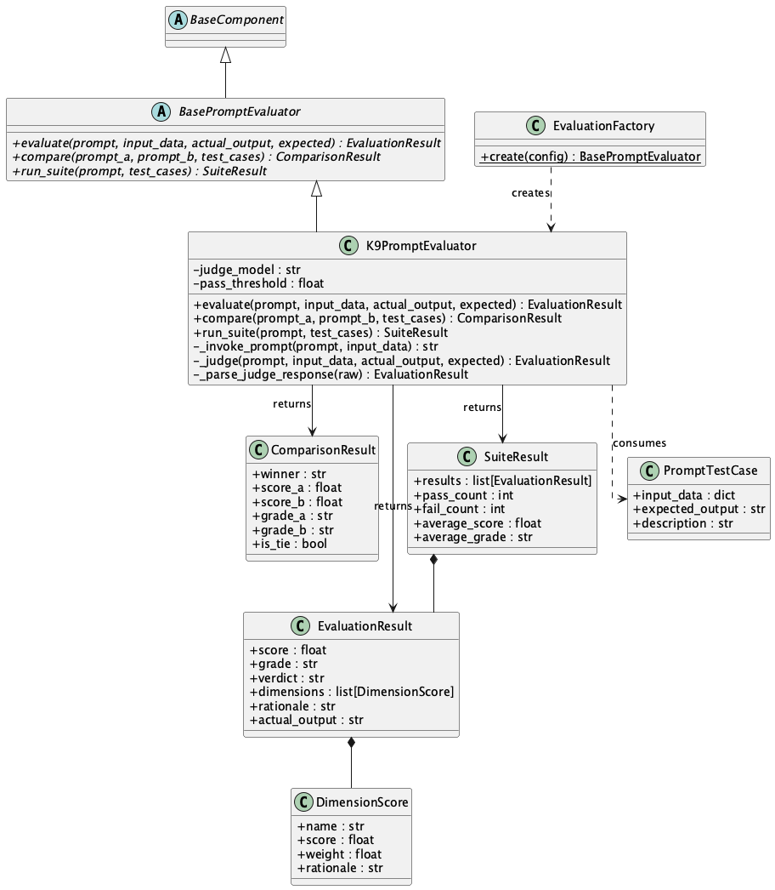
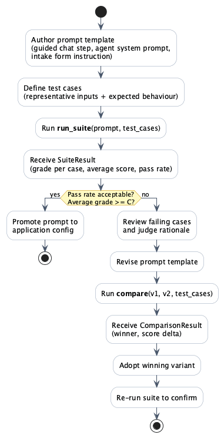

K9-AIF ships `BasePromptEvaluator` — an out-of-the-box prompt evaluation pipeline for Solution Architects building custom agentic applications on the framework. It follows the same ABB/SBB/Factory discipline as every other K9-AIF component: abstract contract, OOB implementation, config-driven extensibility.

**Scope:** this is a development-time and measurement-time tool. It answers the question you ask before a prompt reaches a workflow — how well does this prompt perform across a range of inputs, and what grade does it earn? It is not a runtime gate. Runtime quality enforcement is `K9ValidationLoopAgent`'s responsibility.

---

## BasePromptEvaluator — The ABB Contract

Three operations define the contract:

1. **`evaluate()`** — given a prompt, input data, actual output, and an expectation criterion, return an `EvaluationResult` with score, grade, verdict, and dimension breakdown
2. **`compare()`** — A/B test two prompt variants across a set of test cases; return a `ComparisonResult` identifying the winner and score delta
3. **`run_suite()`** — batch evaluation: run a prompt across a list of `PromptTestCase` objects; return a `SuiteResult` with aggregate pass rate and average grade

[](../assets/images/blogs/k9-prompt-evaluator-class-diagram.png)

---

## K9PromptEvaluator — The OOB SBB

The out-of-the-box implementation uses LLM-as-judge via the framework's existing `llm_invoke()` infrastructure. No external evaluation service. No additional dependencies.

The judge scores five weighted dimensions and returns structured JSON:

| Dimension | Weight |
|---|---|
| Correctness | 35% |
| Completeness | 25% |
| Format compliance | 15% |
| Clarity | 15% |
| Relevance | 10% |

The weighted composite becomes the final score. Grade scale: **A** (90+), **B** (80–89), **C** (70–79), **D** (60–69), **F** (<60). Default PASS threshold: 70.

Each LLM call is tagged with `metadata["operation"]`: `"invoke"` for the prompt execution call, `"evaluate"` for the judge call. This keeps evaluation traffic separate in telemetry, tracing, and model routing — inference and evaluation are distinct concerns.

---

## Developer Workflow

Authored prompt templates — the system prompts, agent instructions, and guided-flow steps that the development team writes — are what get evaluated. Not user input. The workflow:

[](../assets/images/blogs/k9-prompt-authoring-workflow.png)

Author → define test cases → run suite → grade → revise if needed → compare variants → confirm → promote. When the model changes, re-run the suite. The score either holds or it does not.

---

## Config

```yaml
evaluation:
  provider: k9
  pass_threshold: 70
  judge_model: reasoning
```

`EvaluationFactory.create(config)` returns the right implementation. `provider: k9` is the OOB default. Set a custom provider key to resolve your own SBB — the ABB contract guarantees the interface is identical.

---

## Extending It

`K9PromptEvaluator` is one implementation. Solution Architects extend `BasePromptEvaluator` for their domain:

- **Domain-calibrated evaluator** — replace generic dimensions with domain-specific rubrics (citation accuracy, regulatory completeness, clinical precision)
- **Golden-set evaluator** — compare output against a curated reference set using semantic similarity rather than LLM judgment
- **Multi-judge evaluator** — call two models as judges, resolve disagreements by majority or confidence weighting
- **Regression evaluator** — store scores per run, flag when a prompt change drops any dimension by more than N points

All extend `BasePromptEvaluator`, implement three abstract methods, register with `EvaluationFactory`. No changes to callers.

---

## K9Chat Integration

The K9Chat reference application ships with an evaluation toggle in the topbar. Enable it to score every response in real time — a grade pill (A–F) appears beneath each message. Hover to see score, verdict, and the judge's rationale per dimension.

When you switch models in Provider Settings, the grade changes. That delta is signal. It is a development tool, not production scoring.

---

## Test Coverage

Sixteen offline unit tests in `k9_aif_abb/tests/test_k9_prompt_evaluator.py`. All LLM calls mocked by `metadata["operation"]` — judge calls and inference calls tested independently. No network, no live model, no flakiness.

Coverage includes: grade boundary conditions, weighted composite arithmetic, PASS/FAIL thresholds, custom threshold override, malformed judge JSON fallback (score=50, no crash), compare winner detection, tie detection, suite aggregation, all-pass and all-fail states.

---

*K9-AIF is an open architecture for enterprise agentic AI. Source at [k9x.ai](http://k9x.ai).*
