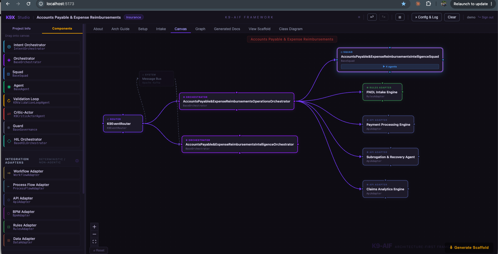

"Let's make it agentic" is the most expensive sentence in enterprise AI right now.

I have watched teams receive a process document — a BPMN diagram, a requirements spec, a swim-lane export — and immediately start wrapping every step in an agent. Intake agent. Payment agent. Rules agent. Analytics agent. The entire process becomes agentic by default. Nobody stops to ask why.

Here is what that costs: higher latency from LLM calls that should never have been made, unpredictable outputs from steps that had deterministic answers, higher operational cost, and test suites that cannot be written because the behavior is non-deterministic by construction.

The right question before any step gets an agent is: does this step require reasoning under uncertainty, or does it execute a known sequence with a predictable answer?

Most enterprise workflow steps are in the second category. Only a few belong in the first.

The architecture decision — agent or adapter — should be made at the design gate, on the canvas, before a line of code is written.

---

## The Classification Gate

K9X Studio now applies a classification gate when you import a BPMN file or a process specification.

Two signals are unambiguous:

**BPMN task type** is a direct signal. A `ServiceTask` calls an external service — that is an API Adapter. A `BusinessRuleTask` invokes a rules engine — that is a Rules Adapter. A `ScriptTask` runs deterministic code — that is a Workflow Adapter. A `SendTask` or `ReceiveTask` fires or waits on a message bus — that is a Messaging Adapter. Only a plain `Task` or a `UserTask` requires a name-based heuristic.

**Governance zone** from a structured spec is equally direct. GREEN-zone steps — flagged deterministic in the spec's agent register — become Integration Adapters. AMBER and RED steps, where reasoning and uncertainty handling are required, become agents (`K9ValidationLoopAgent` or `K9CriticActorAgent`).

The classification runs at import. Nothing waits until scaffold generation.

---

## Accounts Payable — What Got Classified

The canvas above is the result of importing an Accounts Payable & Expense Reimbursements process spec.

The studio produced two orchestrators:

**`AccountsPayable&ExpenseReimbursementsOperationsOrchestrator`** owns the deterministic path. Four steps were classified as Integration Adapters:

| Step | Classification | Reason |
|---|---|---|
| FNOL Intake Engine | Rules Adapter | Intake classification is rule-driven — policy type, claim category, routing table |
| Payment Processing Engine | API Adapter | Calls the payment gateway API — fixed endpoint, fixed contract |
| Subrogation & Recovery Agent | API Adapter | Calls a recovery system API — deterministic lookup, not inference |
| Claims Analytics Engine | API Adapter | Calls an analytics service endpoint — no LLM involved |

**`AccountsPayable&ExpenseReimbursementsIntelligenceOrchestrator`** owns the agentic path. Four steps required inference and were grouped into a squad — the steps where evidence must be correlated, risk must be assessed, or output must be iteratively refined before it can be trusted.

One orchestrator is deterministic. One is agentic. The split is explicit and intentional.

---

## Integration Adapters Are First-Class

Integration Adapters are not placeholder nodes. They are a first-class component type in K9X Studio.

Seven adapter types are available in the palette:

| Type | Maps to | Can chain to |
|---|---|---|
| Messaging Adapter | Kafka, RabbitMQ, SQS/SNS, Azure Service Bus | Workflow Adapter, Process Flow Adapter |
| API Adapter | REST / SOAP / GraphQL endpoint | — |
| Rules Adapter | Drools, ODM, Corticon, any decision engine | — |
| Workflow Adapter | Airflow, Step Functions, IBM BAW | — |
| Process Flow Adapter | MuleSoft, TIBCO, AppConnect, ESB | — |
| BPM Adapter | Camunda, Appian, Pega | — |
| Data Adapter | Database, S3, warehouse, repository | — |

Most adapters are leaf nodes — the Orchestrator calls them and the chain ends. The Messaging Adapter is the exception. An event on Kafka or SQS can trigger a downstream workflow or integration flow, so the canvas allows: `Orchestrator → Messaging Adapter → Workflow Adapter` or `→ Process Flow Adapter`.

An Orchestrator can also call a Workflow Adapter directly for a synchronous trigger — without messaging in between. The SA picks the pattern: synchronous call or event-driven chain.

This makes the deterministic/agentic boundary visible in the architecture diagram rather than buried in implementation detail.

---

## ARCHITECTURE.md — The Decision Record

Every scaffold ZIP now includes `ARCHITECTURE.md`. It is not a summary. It is a classification record.

It lists every step that was classified as an adapter, the adapter type it resolved to, and the rule that produced the classification. It lists every step that was classified as an agent, the agent type, and why.

If an architect disagrees — if Subrogation & Recovery actually requires LLM reasoning in a specific deployment — the file tells them exactly which component to change and how. The scaffold is a starting point. The ARCHITECTURE.md is the gate log.

---

## Put on the Architecture Hat

Learning CrewAI, MCP, LangGraph, and agentic frameworks is valuable. Understanding how agents communicate, how tools are registered, how context flows between steps — all of it matters.

But knowing how to build an agent is not the same as knowing when to build one.

That decision requires putting on the architecture hat. Not the developer hat. Not the AI enthusiasm hat. The architecture hat asks different questions:

- What is the nature of this step — deterministic or uncertain?
- What happens if this step produces a different answer on consecutive runs with the same input?
- What is the cost — in latency, in tokens, in debugging time — of making this step non-deterministic?
- Is there an existing system (a rules engine, a payment gateway, a BPM platform) that already does this correctly?

If the honest answer to those questions points to Appian, MuleSoft, TIBCO, or a well-written service call — that is the right answer. Architecture is not about using AI everywhere. It is about using the right pattern in the right place.

---

## The Rule

Call the LLM when the answer requires reasoning, when the evidence is ambiguous, when the output must be iterated to meet a quality bar.

Use an adapter when the answer is deterministic, the endpoint is fixed, and no inference is required to produce the result.

The architecture decision cannot be deferred to the developer. It belongs at the design gate, on the canvas, before a line of code is written.

---

*K9X Studio ships with seven Integration Adapter types (including Messaging Adapter for event-driven chains), automatic BPMN and spec classification, and ARCHITECTURE.md scaffold generation. `pip install --upgrade k9x` then `k9x studio`.*
