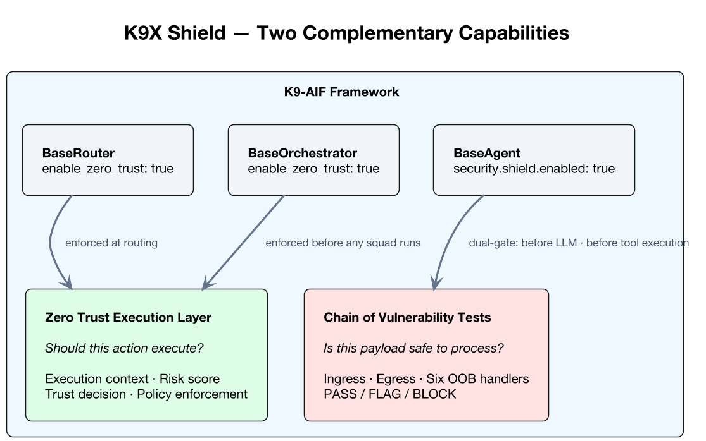

Agentic AI systems rarely fail because of a lack of model capability.

They fail because nothing governs what the model is allowed to execute — or what it is allowed to process.

Most AI frameworks provide coordination, planning, and orchestration. Security is often left to the solution team. That is the wrong architectural boundary. By the time a solution team is wiring in security controls, they are no longer building an application — they are rebuilding framework capabilities.

Security is not a solution-layer concern. It is a first-class architectural capability of the framework itself.

---

## Two Complementary Capabilities

Two complementary capabilities.

**Should this action execute?**
Every agent action carries context — who is initiating it, what data it touches, where it is going. The answer to this question requires evaluating that context against a risk model and producing a decision: allow, deny, allow with obligations, or require approval. This is execution control.

**Is this payload safe to process?**
An authorized agent can still receive a malicious payload. Threat actors embed instructions in documents, search results, and web content. The agent fetches that content and, without architectural safeguards, follows whatever instructions it contains. Stopping that requires inspecting the payload itself — not the execution context. This is payload inspection.

The K9X Shield series covers both.

---

## Where This Lives in the Framework

K9-AIF implements both capabilities inside `k9_security`, a dedicated package within `k9_aif_abb`:

```
k9_aif_abb/k9_security/
├── zero_trust/          ← execution control
└── vulnerability/       ← payload inspection
    └── checks/          ← six OOB vulnerability handlers
```

Both layers are Architecture Building Blocks. Both are configuration-driven. Both integrate through `BaseAgent`'s existing governance hooks.

[](../assets/images/blogs/k9x-shield-linkedin.png)

---

## Enterprise-Level Enforcement

Both capabilities are configuration-driven. That raises a practical question for organizations running multiple K9-AIF solutions: how do you ensure a solution team cannot silently disable a security control?

K9-AIF addresses this through `_policy.locked` in the ABB `config.yaml`. Any key listed there is immutable at the enterprise level — SBB configuration cannot override it, and any override attempt is rejected at config load time with an audit warning.

```yaml
# ABB config.yaml — enterprise policy
_policy:
  locked:
    - enable_zero_trust
    - security.shield.enabled
    - governance.enforce
```

An SBB that sets `enable_zero_trust: false` in its own `config.yaml` will have that override silently rejected. The ABB value holds. The framework logs the attempted override. Every Router, Orchestrator, and Agent receives the enforced value — not what the SBB requested.

Security controls set at the framework level cannot be disabled at the solution level.

---

## The Series

[**Part 1 — Zero Trust for Agentic Systems**](/zero-trust-execution-layer-agentic-systems/)

Covers the Zero Trust Execution Layer: execution context, trust decisions, policy enforcement, and how `BaseOrchestrator` and `BaseAgent` enforce the layer at every execution boundary.

[**Part 2 — K9X Shield: Security as an Architectural Capability**](/k9x-shield-chain-of-vulnerability-tests/)

Covers the Chain of Vulnerability Tests: `VulnerabilityChain`, `BaseVulnerabilityCheck`, the three-state result model (PASS / FLAG / BLOCK), the six OOB handlers, dual-gate ingress and egress, and `ShieldGovernance`.

---

## References

- K9-AIF Framework: https://github.com/k9aif/k9-aif-framework
- PyPI (k9-aif 1.8.1): https://pypi.org/project/k9-aif/
- Blog: https://blog.k9x.ai
