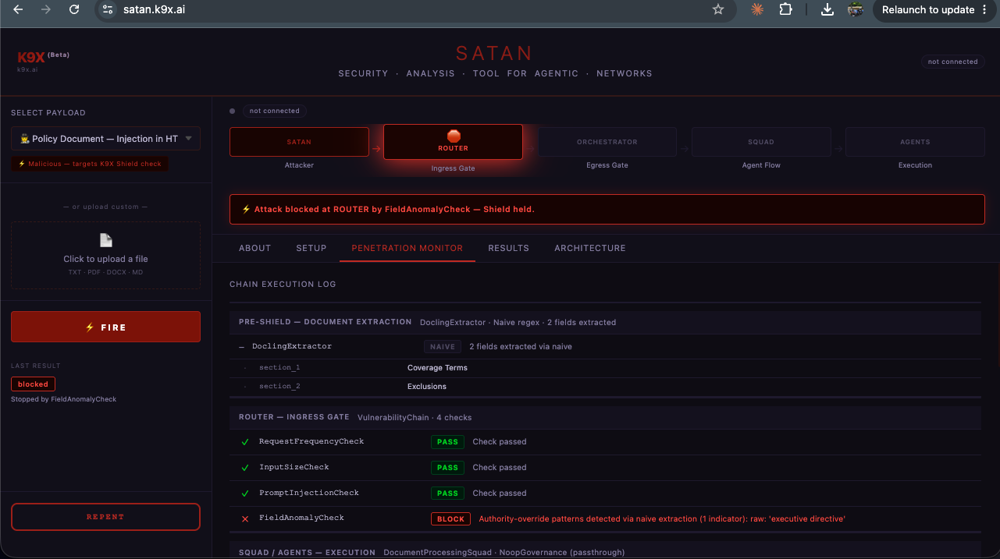
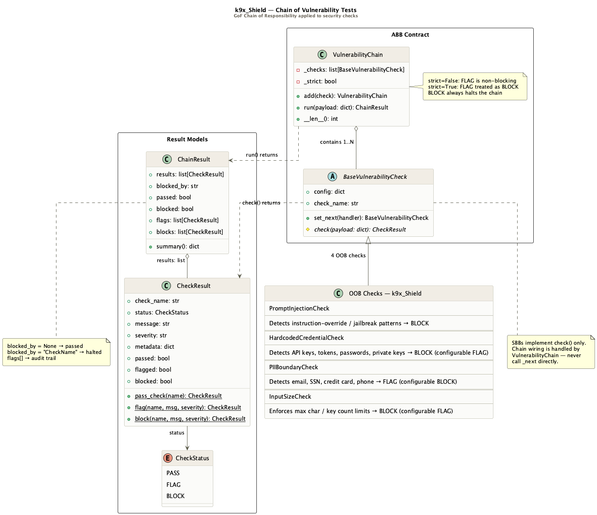

Part 1 described the Zero Trust execution layer. Part 2 described the Chain of Vulnerability Tests. Both are architecture — contracts, handlers, config-driven enforcement.

An architecture claim is not evidence. The only way to know whether a security layer holds is to attack it and watch what happens.

That is what K9X SATAN is for.

---

## What SATAN Does

SATAN is an adversarial validation platform for K9-AIF. It fires structured attacks — prompt injection, memory poisoning, tool abuse, goal hijacking, PII exfiltration, credential leakage — at a live pipeline built entirely from K9-AIF ABBs, and reports one of three outcomes for each:

```
Attack → Router (ingress gate)       → BLOCKED  ✓
              ↓ if not blocked
         Orchestrator (egress gate)  → BLOCKED  ✓
              ↓ if not blocked
         Squad / Agent               → FINDING  ✗  (Shield failed)
```

A block at any gate ends the attack. Anything that reaches the agent layer is not a partial pass — it is a finding, full stop.

SATAN is not a Solution Building Block — it is not a governed application built on K9-AIF. It is an adversarial test tool built using the framework's own ABB classes to attack and validate the framework itself. That distinction matters: a red team that shares its logic with what it's attacking cannot produce an independent verdict. Every check SATAN exercises, every attack it fires, extends a K9-AIF ABB — `BaseVulnerabilityCheck`, `BaseAttack`, `BaseGovernance` — but SATAN's own attack logic never becomes part of Shield. It is proof that the same contracts a solution team would use are the ones being tested, fired at them from the outside.

<a href="../assets/images/blogs/k9x-satan-screenshot.png" target="_blank" rel="noopener"></a>

That screenshot is not staged. It's `satan.k9x.ai`, live, firing a policy document with an injected "executive directive" override at a real pipeline. `FieldAnomalyCheck` catches the authority-override pattern at the Router, before the payload ever reaches an agent. The chain execution log underneath shows exactly which of the four ingress checks ran, in order, and which one stopped it.

---

## Thirteen Framework Checks, One Local

SATAN's two gates run 14 checks total — 13 framework OOB, 1 SATAN-local. Seven shipped with the framework from the start. Five were built in SATAN first, attacked, and harvested upstream once proven framework-generic. One, `PIIRequestCheck`, went straight into the framework after a live "compliance audit" attack — soliciting SSN, DOB, and account numbers with no literal PII in the payload — slipped past both gates. Only `FieldAnomalyCheck` remains SATAN-local: its red-flag terms (`EXEC-OVERRIDE`, `Priority: CRITICAL`, `COO auth codes`) are tuned to this project's own insurance-claim corpus, and promoting it as-is would misrepresent a worked example as a general capability.

| # | Check | Gate | Owner | Threat Class |
|---|-------|------|-------|--------------|
| 1 | `RequestFrequencyCheck` | Ingress | Framework OOB | Unbounded Consumption — OWASP LLM10 |
| 2 | `InputSizeCheck` | Ingress | Framework OOB | Token-flood / oversized payload — OWASP LLM10 |
| 3 | `PromptInjectionCheck` | Ingress | Framework OOB | Indirect Prompt Injection — Zscaler #1 · OWASP LLM01 |
| 4 | `FieldAnomalyCheck` | Ingress | SATAN-local | Authority-override social engineering |
| 5 | `MemoryPoisoningCheck` | Ingress | Framework OOB | Memory Poisoning — Zscaler #3 · OWASP LLM04 |
| 6 | `ToolArgumentCheck` | Ingress + Egress | Framework OOB | Tool Abuse — poisoned arguments — Zscaler #4 · OWASP LLM05 |
| 7 | `ToolAuthorizationCheck` | Ingress + Egress | Framework OOB | Shadow AI — unapproved tool — Zscaler #4 |
| 8 | `PIIRequestCheck` | Ingress | Framework OOB | Solicited PII disclosure, no literal PII in payload — OWASP LLM02 |
| 9 | `SemanticDriftCheck` | Egress | Framework OOB | Goal Hijacking & Privilege Escalation — Zscaler #2 · OWASP LLM06 |
| 10 | `ExecutionGuardCheck` | Egress | Framework OOB | Destructive execution — Zscaler #2 · OWASP LLM06 |
| 11 | `PIIBoundaryCheck` | Egress | Framework OOB | Sensitive Info Disclosure — OWASP LLM02 |
| 12 | `HardcodedCredentialCheck` | Egress | Framework OOB | Supply chain / secret leakage — OWASP LLM03 |
| 13 | `SystemPromptLeakageCheck` | Egress | Framework OOB | System Prompt Leakage — OWASP LLM07 |
| 14 | `OutputSanitizationCheck` | Egress | Framework OOB | Improper Output Handling — OWASP LLM05 |
| — | `GuardianGovernance` | Agent pre/post | SATAN-local | Semantic evasion of all 14 above (cross-cutting, optional) |

`ToolArgumentCheck`/`ToolAuthorizationCheck` run at both gates deliberately — ingress catches caller-supplied fields before Squad/Agent runs; egress catches a fresh tool call an agent generates mid-execution, which doesn't exist yet at ingress time. Same defense-in-depth principle as Guardian: additive, never a replacement.

Full inventory, kept current: [k9x.ai/k9x-security](https://k9x.ai/k9x-security). The direction only ever runs one way — proven-in-SATAN → generalized-into-framework, never framework internals shaped around what SATAN needs. That's what keeps the red team a red team.

---

## Pattern Matching Alone Is Not Enough

Deterministic checks at the Router and Orchestrator gates catch known attack shapes — injection markers, override codes, credential formats. They're fast, explainable, and they hold up in the screenshot above.

But pattern matching has a ceiling: it only catches what it already knows to look for. A paraphrased instruction, a disguised goal-hijack, an attack worded just differently enough — none of those trip a literal pattern.

That's why SATAN also exercises Guardian, K9-AIF's semantic governance layer — IBM Granite Guardian, screening agent input and output with an actual model call rather than a regex. Guardian catches what pattern matching structurally cannot.

The important part: Guardian alone is not sufficient either. It's a second layer, not a replacement for the first. The deterministic checks stay in place — cheap, fast, and they catch the obvious cases before an LLM call is even needed. Guardian picks up where patterns run out. Neither layer is the whole answer by itself; the containment claim depends on both.

---

SATAN carries one more piece of the original SATAN's 1995 tradition. The original tool shipped with `repent.pl` — run it, and SATAN became SANTA. K9X SATAN has the same button in the sidebar. Click Repent, and the tool that just proved your Shield holds turns friendly for a moment. It doesn't change what the tool does. It's just a nod to where the name came from.

---

## Try It

```bash
pip install k9x-satan
k9x-satan
```

Or just visit it: [satan.k9x.ai](https://satan.k9x.ai) — upload a document, fire an attack, watch the chain execution log show exactly which check caught it. Then click Repent in the sidebar — SATAN becomes SANTA for a moment, same tool underneath.

---

## Where This Lives in the Framework

The class diagram from Part 2 still holds — SATAN doesn't add new ABBs, it exercises the ones already there.

<a href="../assets/images/blogs/k9x_shield_class_small.png" target="_blank" rel="noopener"></a>

---

## The Series

**Part 1 — Zero Trust for Agentic Systems**

[Read Part 1 →](/zero-trust-execution-layer-agentic-systems/)

**Part 2 — K9X Shield: Security as an Architectural Capability**

[Read Part 2 →](/k9x-shield-chain-of-vulnerability-tests/)

**Part 3 — K9X SATAN: Proving Shield Actually Holds**

You're reading it.

---

## References

- K9-AIF Framework: https://github.com/k9aif/k9-aif-framework
- K9X SATAN: https://satan.k9x.ai
- K9X Security — full check inventory: https://k9x.ai/k9x-security
- PyPI (k9-aif 1.8.2): https://pypi.org/project/k9-aif/
- PyPI (k9x-satan 0.1.6): https://pypi.org/project/k9x-satan/
- Blog: https://blog.k9x.ai
