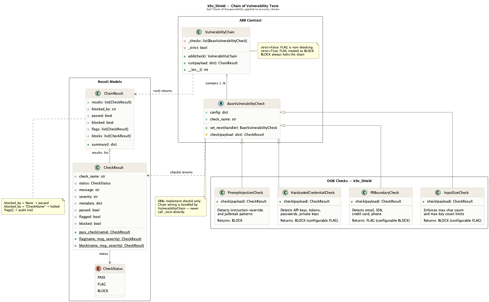

[Part 1 of this series](/2026/04/26/zero-trust-execution-layer-agentic-systems.html) covered the Zero Trust Execution Layer in K9-AIF — how every action an agent takes is evaluated against execution context: identity, data sensitivity, destination, risk score. The question that layer answers is: **"Should this action execute?"**

That is a necessary question. It is not a sufficient one.

Because the action can be authorized, the agent can be legitimate, and the payload can still be malicious. Zscaler ThreatLabz has identified Indirect Prompt Injection as the primary attack vector against agentic AI systems — threat actors embedding hidden instructions in websites, documents, and manipulated search results. The agent fetches that content, trusts it, and executes whatever it says: authorizing fraudulent payments, leaking sensitive data, escalating its own privileges beyond what the task required.

Unlike a human reviewer, an LLM has no inherent notion of trusted versus attacker-controlled content. It follows instructions regardless of their origin unless architectural safeguards intervene.

This is the second question: **"Is this payload safe to process?"** Zero Trust does not answer it. K9X Shield does.

---

## Prompt Injection Is Only the Beginning

Zscaler ThreatLabz maps four distinct vectors in the agentic AI threat landscape:

**Indirect Prompt Injection (IPI)** — malicious instructions embedded in external content the agent retrieves: web pages, search results, fetched documents. The agent trusts the content source; the attacker controls the content.

**Goal Hijacking and Privilege Escalation** — agentic systems break goals into subtasks autonomously. An attacker who can influence one subtask can force the agent to access resources well beyond what the original task required. The agent was given permission to read; it ends up writing.

**Memory Poisoning** — agents with persistent memory are particularly vulnerable. Corrupt the memory store with malicious instructions, and every future interaction inherits the contamination. The attack surface extends across sessions, not just the current one.

**Shadow AI and Tool Abuse** — unapproved local AI tools, browser extensions, and developer plugins create hidden integration points. The enterprise perimeter has no visibility into what these tools are doing with agent-generated content.

Each of these vectors requires a different detection posture. A single signature-based filter does not cover all four. The architecture needs to express that — a chain, not a monolith.

---

## A Pattern You Already Know

The classic Chain of Responsibility pattern: each handler gets the request, does one thing, and either stops the chain or passes it forward.

Apply it to security checks and the algebra becomes very clean.

Every incoming payload runs through a chain. Each handler inspects the payload for one class of vulnerability. If it finds one, it either flags the result for audit (FLAG, non-blocking) or halts the entire chain and prevents the payload from reaching any agent (BLOCK, terminal). The chain grows. You do not modify existing handlers. You add new ones.

This is the open-closed principle applied to security. A new attack vector from the next Zscaler ThreatLabz report means one new handler. Nothing else changes.

```python
chain = (
    VulnerabilityChain()

    # Resource protection
    .add(InputSizeCheck())           # BLOCK — prompt flooding, token exhaustion

    # Prompt integrity
    .add(PromptInjectionCheck())     # BLOCK — instruction override, jailbreak

    # Tool safety
    .add(ToolArgumentCheck())        # BLOCK — SQL, shell, path traversal, SSRF

    # Agent behavior
    .add(SemanticDriftCheck())       # BLOCK — goal hijacking, identity override, loop traps

    # Data protection
    .add(PIIBoundaryCheck())         # FLAG  — cross-boundary PII exposure

    # Final execution gate
    .add(ExecutionGuardCheck())      # BLOCK — filesystem, process execution, privilege escalation,
                                     #         persistence, destructive operations
)

result = chain.run(payload)
if result.blocked:
    raise PermissionError(f"Shield blocked by: {result.blocked_by}")
```

Six handlers. Each Zscaler-identified vector maps to an extension point in this chain — not a rewrite.

---

## Three States, Not Two

Most security checks return binary results — pass or fail. That is a coarse signal in a system where an audit team needs to distinguish between a definitively safe payload, a safe payload with something worth logging, and a payload that must never reach an agent.

k9x_Shield uses three states:

**PASS** — the check found nothing. The chain continues.

**FLAG** — the check found something worth recording, but the payload is not dangerous enough to halt. PII in a payload field is a FLAG. The audit log gets an entry. The agent gets the payload. In strict mode, FLAGS become BLOCKs — the same chain works for both permissive and zero-tolerance configurations.

**BLOCK** — the chain stops immediately. The payload never reaches any agent. The error surface is the shield, not the LLM.

The `blocked_by` field on the result carries the name of the check that halted the chain. That is enough for the security team to correlate an incident to a specific vulnerability class without digging into agent logs.

---

## ABB and SBB

In K9X-AIF terms, `BaseVulnerabilityCheck` is the ABB contract. `VulnerabilityChain` is the assembler. Every handler in the chain is an SBB — one class, one method, one concern. The ABB defines the contract. The chain defines the execution model. The SBB provides the domain-specific detection logic.

A domain team adding a GxP traceability check implements `BaseVulnerabilityCheck.check()` and adds it to the chain. They do not touch the chain runner. They do not touch the other handlers:

```python
chain.add(GxPTraceabilityCheck(config={"block_on_match": True}))
```

The same pattern applies when Indirect Prompt Injection detection needs to be scoped to specific externally-fetched fields:

```python
chain.add(IndirectPromptInjectionCheck(config={
    "external_content_fields": ["web_result", "document_excerpt", "search_snippet"],
    "block_on_match": True,
}))
```

This is the same pattern used for model routing, secret management, and object storage in K9X-AIF. The framework abstracts the chain mechanics. The SBB owns the domain knowledge. The separation holds.

Many of these handlers naturally map to the OWASP Top 10 for LLM Applications, but K9X Shield intentionally remains framework-agnostic. The ABB defines the inspection contract; individual handlers may implement OWASP, MITRE ATLAS, or enterprise-specific security policies.

K9X Shield does not require a new integration point. `BaseAgent` — the core of every K9-AIF agent — already exposes `pre_process()` and `post_process()` governance hooks. An SBB team implements a `ShieldGovernance` class that runs `VulnerabilityChain` inside those two methods: the ingress chain runs on the incoming payload before it reaches the LLM; the egress chain runs on the LLM's generated output before any tool executes. Every agent in every squad gets dual-gate protection without touching a single line of agent code. The core was already designed for this.

The configuration lives in `config.yaml` under a `security.shield` block — the same place inference, cache, and object storage are configured. No separate security file. One place to look.

The ABB framework config defines the block with Shield disabled — every check is declared, nothing fires until a solution explicitly turns it on:

```yaml
# k9_aif_abb/config/config.yaml — framework default (disabled)
security:
  shield:
    enabled: false        # present, off by default
    strict: false
    ingress:
      checks:
        - InputSizeCheck
        - PromptInjectionCheck
        - PIIBoundaryCheck
    egress:
      checks:
        - SemanticDriftCheck
        - ToolArgumentCheck
        - ExecutionGuardCheck
        - PIIBoundaryCheck
```

An SBB solution overrides one key in its own `config.yaml` to activate it:

```yaml
# examples/MySolution/config/config.yaml — SBB override (enabled)
security:
  shield:
    enabled: true          # one key — Shield activates across all agents in this solution
    strict: false          # strict: true promotes FLAG → BLOCK across all checks
```

The check lists, gate assignments, and chain order are inherited from the ABB default. The SBB only states intent — the framework applies it.

`ShieldGovernance` reads that block and assembles the two chains:

```python
pre_chain = (
    VulnerabilityChain()
    .add(InputSizeCheck())       # BLOCK — prompt flooding, token exhaustion
    .add(PromptInjectionCheck()) # BLOCK — instruction override, jailbreak
    .add(PIIBoundaryCheck())     # FLAG  — inbound sensitive data
)

post_chain = (
    VulnerabilityChain()
    .add(SemanticDriftCheck())   # BLOCK — goal hijacking, identity override, loop traps
    .add(ToolArgumentCheck())    # BLOCK — SQL, shell, path traversal, SSRF
    .add(ExecutionGuardCheck())  # BLOCK — filesystem, reverse shell, privilege escalation
    .add(PIIBoundaryCheck())     # FLAG  — outbound sensitive data
)
```

Then wires them into `BaseAgent`'s pre/post hooks:

```python
class ShieldGovernance:
    def pre_process(self, payload: dict) -> None:
        result = pre_chain.run(payload)            # ingress — before LLM
        if result.blocked:
            raise PermissionError(f"Shield blocked ingress: {result.blocked_by}")

    def post_process(self, output: dict) -> None:
        result = post_chain.run(output)            # egress — before tool execution
        if result.blocked:
            raise PermissionError(f"Shield blocked egress: {result.blocked_by}")
```

`PIIBoundaryCheck` appears in both chains intentionally — inbound and outbound are different surfaces, same check. No agent code changes. No new framework wiring. The config declares the chain; the hooks execute it.

---

## What This Covers

The six OOB handlers address the immediate attack surface on an AI system receiving external payloads:


| Check                  | Default | Category             | Vector addressed                                                                         |
| ------------------------ | --------- | ---------------------- | ------------------------------------------------------------------------------------------ |
| `InputSizeCheck`       | BLOCK   | Resource protection  | Prompt flooding, token exhaustion                                                        |
| `PromptInjectionCheck` | BLOCK   | Prompt integrity     | Direct instruction override, jailbreak                                                   |
| `ToolArgumentCheck`    | BLOCK   | Tool safety          | SQL / command / path traversal / SSRF in LLM-generated tool arguments                    |
| `SemanticDriftCheck`   | BLOCK   | Agent behavior       | Goal hijacking, identity override, loop traps                                            |
| `PIIBoundaryCheck`     | FLAG    | Data protection      | Cross-boundary PII exposure                                                              |
| `ExecutionGuardCheck`  | BLOCK   | Final execution gate | Filesystem, process execution, privilege escalation, persistence, destructive operations |

Extending the chain further:


| Planned handler                | Default | Vector                                                      |
| -------------------------------- | --------- | ------------------------------------------------------------- |
| `IndirectPromptInjectionCheck` | BLOCK   | IPI — malicious instructions in externally-fetched content |
| `MemoryPoisoningCheck`         | BLOCK   | Persistent memory and vector store contamination            |
| `PrivilegeBoundaryCheck`       | BLOCK   | Multi-tenant data access — identity-aware egress control   |

What the chain does not replace: Zero Trust network policy, AI asset discovery, endpoint protection for local AI tools, or egress controls. Zscaler's own recommendations — least-privileged access, strict tool allowlists, egress limits — are infrastructure-layer controls that sit alongside this application-layer chain, not instead of it.

Defense in depth means both layers. The shield is one of them.

---

## Two Layers, One Architecture

Part 1 and Part 2 of this series guard different surfaces.

The Zero Trust Execution Layer evaluates the *actor and the action* — identity, context, destination, risk score. An authorized agent that clears that layer can still receive a malicious payload. K9X Shield evaluates the *payload content* — what is inside the data being handed to that authorized agent. A clean payload that clears the Shield can still arrive from an unauthorized execution context.

Neither replaces the other. Zero Trust controls who does what. K9X Shield controls what enters the processing pipeline. Together they are the two rings of defense-in-depth for agentic AI.

---

## On the Name

AWS Shield is a managed DDoS protection service. The brand position is clear: something is trying to hit your infrastructure at scale, and the shield absorbs it before it reaches your application.

K9X\_Shield occupies the same design intent at the AI layer. Payloads are the attack surface. Agents are the infrastructure that needs protecting. The chain is the shield that sits in front of them.

The chain is open-ended by design. Zscaler's four vectors are not a ceiling — they are the current known surface. As agentic systems become more capable and more autonomous, the attack surface expands. Each new vector is one new handler. The chain does not need to be rewritten. It just needs one more link.

---

## Class Structure



---

k9x\_Shield is available in the K9-AIF framework under `k9_aif_abb/k9_security/vulnerability/`. Six OOB handlers ship with the framework. Custom handlers extend `BaseVulnerabilityCheck` — one method, one class.

---

## Closing Thought

Agentic AI does not become secure because the model becomes smarter.

It becomes secure because the surrounding architecture assumes that every external payload could be hostile.

K9X Shield embodies that principle — treating vulnerability inspection as a first-class architectural capability rather than an afterthought.

---

## References

- K9-AIF Framework: https://github.com/k9aif/k9-aif-framework
- PyPI — `pip install k9-aif`: https://pypi.org/project/k9-aif/
- Blog: https://blog.k9x.ai
- Zscaler ThreatLabz — Agentic AI Security Research: https://www.zscaler.com/threatlabz
- OWASP Top 10 for LLM Applications: https://owasp.org/www-project-top-10-for-large-language-model-applications/

---

*This is Part 2 of the K9X Shield series. [← Back to Part 1: Zero Trust for Agentic Systems](/2026/04/26/zero-trust-execution-layer-agentic-systems.html)*

*For a complete overview of what ships in the framework: [K9X Shield — Security as a Framework Capability, Not a Post](/2026/07/18/k9x-shield-framework-security-capability.html)*
