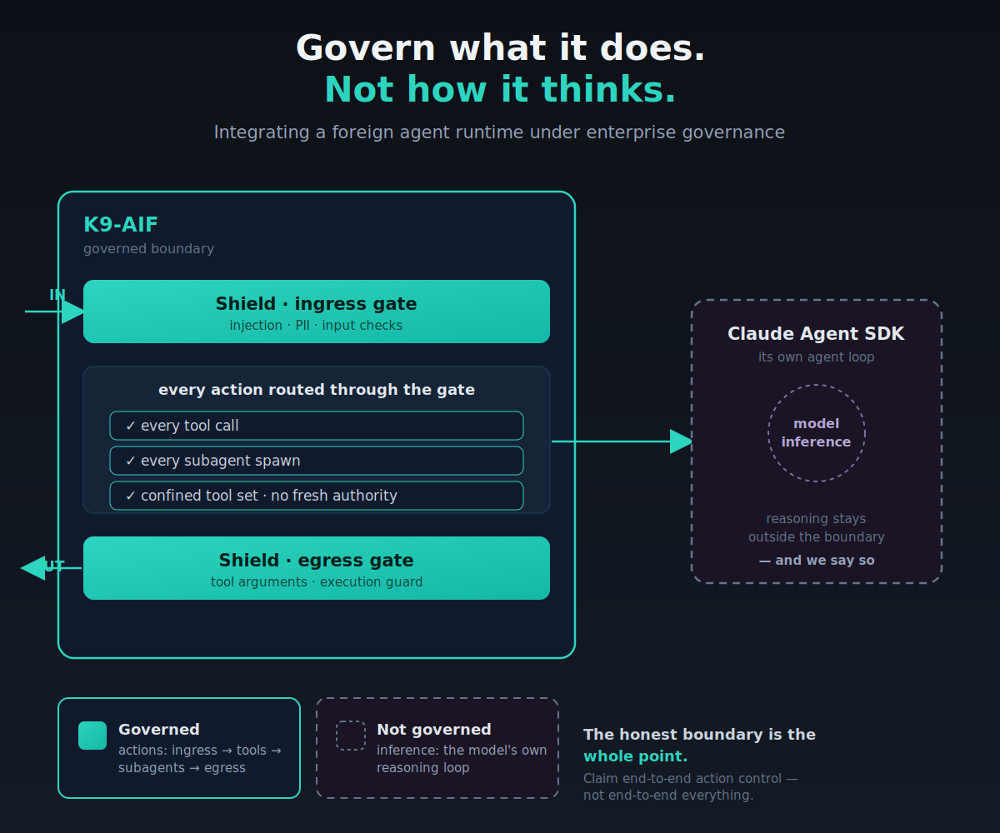

I'd been reading Anthropic's [Building Effective Agents](https://www.anthropic.com/engineering/building-effective-agents) alongside the Claude Agent SDK docs, mostly just to understand how Anthropic itself thinks about agent design. Somewhere in there I noticed the obvious thing that's easy to skip past: the Agent SDK only works with Claude models. Not "Claude by default." Claude, full stop.

That's a reasonable design choice for Anthropic's own SDK. But it's exactly the kind of detail that matters if you're building on K9-AIF, where every other integration point (native agents, CrewAI crews) is provider-agnostic by construction. So the question I actually sat with was narrower than "should we use the Claude Agent SDK": it was, for an organization standardizing on Claude, migrating or modernizing onto it, how would K9-AIF blend this SDK in without quietly giving up what the framework is for?

That question turned out to have a real, verifiable answer, and a boundary I wasn't expecting to be this clean.

---

## What "blend it in" actually has to mean

K9-AIF's whole architecture rests on a small number of guarantees: every agent boundary is governed, every action is checked against policy before it executes, every routing decision is auditable. `k9_adapters/crewai/` already does this for CrewAI: a `CrewAIOrchestratorAdapter` wraps a Crew, and `K9XLiteLLMBridgeAdapter` routes every one of that Crew's model calls through `llm_invoke`, so a CrewAI agent is just as provider-agnostic and just as governed as a native one.

I already knew this pattern well, having built the CrewAI adapter myself. So the plan was straightforward: inherit the right framework base classes, the same way I had for CrewAI, and build an equivalent adapter for the Claude Agent SDK: `BaseOrchestrator`, `BaseAdapter`, a payload mapper, the whole shape.

But here, I would not be able to use the framework's Intelligent Model Router the same way. The parallel held for about half the adapter.

---

## The half that holds: action governance

The Claude Agent SDK exposes real seams for controlling what an agent is allowed to *do*, and they're stronger than I expected:

- **`allowed_tools`** on `ClaudeAgentOptions`: the adapter builds this itself, from its own internal tool registry. The SDK never receives a tool it wasn't handed by the adapter.
- **`can_use_tool`**: a dedicated callback, fired before every tool call executes. The adapter routes it straight into `apply_post_governance()`, the same call every other K9-AIF component makes, which resolves to k9x_Shield's egress chain (`ToolArgumentCheck`, `ExecutionGuardCheck`, `SemanticDriftCheck`) when Shield is configured.
- **Subagents**: the Agent SDK can spawn its own subagents mid-session via `ClaudeAgentOptions.agents`. Each subagent gets its own confined `tools` list, validated against the adapter's own registry at construction time. Ask for a tool the adapter never registered, and construction raises `ValueError`, not a warning, not a silent narrowing.

That last point is the one worth being precise about, because it's easy to assert and hard to actually prove. Does a spawned subagent's tool call go through the same `can_use_tool` gate as the top-level agent, or does it get its own, separate, possibly weaker check? I didn't want to answer that from the docs. I went into the installed package's own source (`_internal/query.py`) and checked the control-request handler directly. Every `can_use_tool` request, top-level agent or subagent, hits the identical callback. `ToolPermissionContext.agent_id` is how you'd tell them apart, not a separate path that lets one bypass the gate the other has to pass through.

That's the difference between a governance claim and a governance guarantee. One is a sentence in a README. The other is a fact you can point to a line number for.

---

## The half that doesn't: inference governance

Here's where the parallel with CrewAI actually breaks, and no amount of adapter cleverness closes it.

`K9XLiteLLMBridgeAdapter` works because CrewAI hands you an injectable seam: `Agent(llm=...)` accepts anything implementing `BaseLLM.call()`, so the bridge substitutes itself in and every model call flows through `llm_invoke → K9ModelRouter → LLMFactory` like any native K9-AIF agent's would. Provider-agnostic, governed, audited.

The Claude Agent SDK has no equivalent seam. I checked four separate ways before I was willing to say so plainly instead of hedging it:

1. Not one of `ClaudeAgentOptions`'s ~40 fields is an injectable model client. `model` and `fallback_model` are plain strings: configuration, not a substitution point.
2. `query()`'s `transport` parameter looked like it might be one, until I actually read `Transport`'s abstract methods (`connect`, `write`, `read_messages`, `close`). It's raw process/network I/O with the bundled `claude` CLI: a JSON-RPC-shaped control protocol, not a place to intercept "the model is about to answer."
3. Nothing in the installed package's own source references a base-URL override.
4. Anthropic's own docs are direct about it: alternate backends are Bedrock, Vertex, Azure Foundry (all still Claude, just different hosting), and third-party redirection of inference beyond that isn't a supported path for Agent SDK integrations.

So the honest statement is: the Claude Agent SDK's own reasoning loop cannot be routed through `llm_invoke`. Not yet, and not because the adapter is incomplete. It's structural, a property of what the product is: Anthropic's own harness, authenticating and reasoning end to end inside a subprocess K9-AIF doesn't own.

I'll admit the tempting move here was to build something that looked like it solved this anyway: some `hooks`-based approximation that logs the inference and calls it "governed." That would have been the wrong artifact. A fabricated seam is worse than an honest gap, because it teaches the next person reading the code to trust something that isn't real.

---

## Naming the boundary instead of hiding it

So the adapter is explicit about a conformance tier: **action-governed, not fully-governed.** Every tool call, every subagent spawn, ingress, egress, Zero Trust: real. Model inference: outside the framework's reach, permanently, documented as exactly that in the adapter's own `CLAUDE.md` rather than left as a surprise for whoever reads the code next.

If a solution genuinely needs Claude with governance on *both* axes (actions and inference), the answer isn't this adapter. It's the plain Anthropic Client SDK (`anthropic.messages.create()`) wrapped as a `BaseLLM` adapter, the same relationship Pet Store Agentic's `DirectApiDiagnosisAgent` already has to its SDK-backed sibling: you write the tool-use loop yourself, in K9-AIF's own agent code, and in exchange every model call routes through `llm_invoke` like anything else. That path trades away the Agent SDK's autonomous loop for full governance. This adapter trades the other way: keep Claude's own loop, contain everything it's allowed to act on.

Neither is more "correct." They're different tradeoffs for different needs, and the framework should let you pick, not blur the line between them.

---

## Where this lives

`k9_adapters/claude_agent_sdk/`: `ClaudeAgentSDKOrchestratorAdapter`, `ClaudeAgentSDKPayloadMapper`, `K9ClaudeAgentSDKAdapter`, built parallel to `k9_adapters/crewai/`. `claude-agent-sdk==0.2.128` pinned in `requirements.txt`. The package's own `CLAUDE.md` records the verified facts above, including the exact `_internal/query.py` check for subagent routing, so the next person working in this folder doesn't have to re-derive any of it from scratch.

The goal was never to make the model reason the way K9-AIF wants. It's to make sure that whatever it decides to do next has to clear a gate first, and to be straight about the one place that gate doesn't reach.

---

## References

- K9-AIF Framework: [github.com/k9aif/k9-aif-framework](https://github.com/k9aif/k9-aif-framework)
- Anthropic, Building Effective Agents: [anthropic.com/engineering/building-effective-agents](https://www.anthropic.com/engineering/building-effective-agents)
- Claude Agent SDK docs: [code.claude.com/docs/en/agent-sdk/overview](https://code.claude.com/docs/en/agent-sdk/overview)
- `k9_adapters/claude_agent_sdk/`: in the framework repo above
- PyPI (k9-aif): [pypi.org/project/k9-aif](https://pypi.org/project/k9-aif/)
