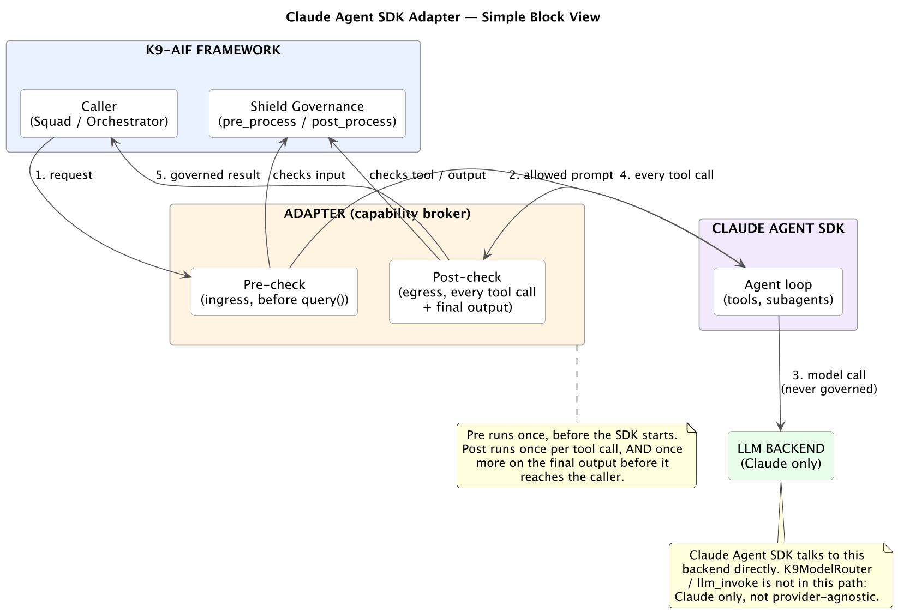
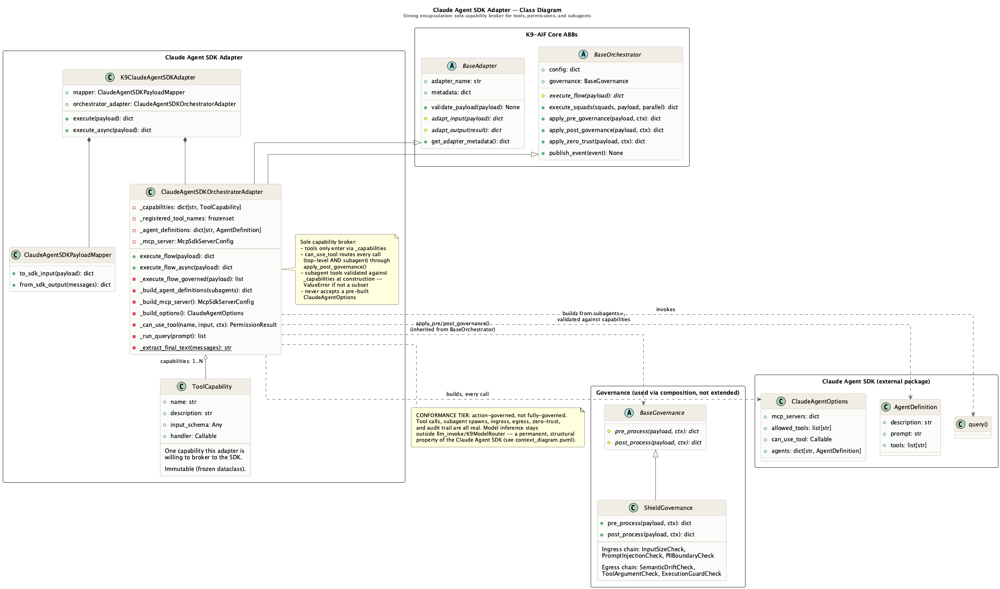

I'd been reading Anthropic's [Building Effective Agents](https://www.anthropic.com/engineering/building-effective-agents) alongside the Claude Agent SDK docs, mostly just to understand how Anthropic itself thinks about agent design. Somewhere in there I noticed the obvious thing that's easy to skip past: the Agent SDK only works with Claude models. Not "Claude by default." Claude, full stop.

That's a reasonable design choice for Anthropic's own SDK. But it's exactly the kind of detail that matters if you're building on K9-AIF, where every other integration point (native agents, CrewAI crews) is provider-agnostic by construction. So the question I actually sat with was narrower than "should we use the Claude Agent SDK": it was, for an organization standardizing on Claude, migrating or modernizing onto it, how would K9-AIF blend this SDK in without quietly giving up what the framework is for?

That question turned out to have a real, verifiable answer, and a boundary I wasn't expecting to be this clean.

---

## What "blend it in" actually has to mean

K9-AIF's whole architecture rests on a small number of guarantees: every agent boundary is governed, every action is checked against policy before it executes, every routing decision is auditable, and every model call routes through `llm_invoke` so the same agent runs against Ollama, OpenAI, or Watsonx without touching its code. The framework already has an adapter proving that holds for an external agent framework, not just native agents.

I'd built that adapter myself, for CrewAI, so I already knew the pattern cold. The plan was straightforward: inherit the right framework base classes and build the equivalent for the Claude Agent SDK: `BaseOrchestrator`, `BaseAdapter`, a payload mapper, the whole shape.

But here, I would not be able to use the framework's Intelligent Model Router the same way. The parallel held for about half the adapter.

---

## The half that holds: action governance

The Claude Agent SDK gives you three real levers over what an agent is allowed to *do*, and they're stronger than I expected:

- **What tools it can see at all.** The adapter decides the full list up front, from its own internal registry. The SDK never gets handed a tool the adapter didn't put there itself.
- **What tool it can actually use, in the moment.** Before every single tool call runs, the SDK stops and asks the adapter for permission. The adapter checks that request against K9-AIF's own security layer, k9x_Shield, before answering yes or no.
- **What a spawned sub-agent is allowed to touch.** The Agent SDK can spin up its own helper agents mid-task. Each one only gets the tools the adapter explicitly hands it. Ask for anything outside that list, and the whole thing refuses to even start, rather than quietly leaving something out.

That last point is the one worth being careful about, because it's easy to claim and hard to actually prove. Does a helper agent's tool request get checked the same way the main agent's does, or does it get a separate, possibly weaker check? I didn't want to answer that from the docs alone, so I read the SDK's own source code directly. Every permission request, from the main agent or a helper, goes through the exact same check. There's no separate, weaker door.

That's the difference between a governance claim and a governance guarantee. One is a sentence in a README. The other is a fact you can point to a line of code for.

Here's the shape of it:

Read left to right: a request comes in from a K9-AIF caller (1) and gets checked before anything else happens. Only once it clears that check does Claude's own agent loop even start (2). Claude reasons and decides which tools to call, but every one of those calls comes straight back through the same check before it's allowed to run (4). The model call itself (3) is the one box in the middle nothing here touches. Once the loop finishes, the result goes through one last check before it's handed back (5). Five steps. The SDK owns exactly one of them.

---

## The half that doesn't: inference governance

Here's where the parallel with CrewAI actually breaks, and no amount of adapter cleverness closes it.

CrewAI lets you swap in your own model client. That's the trick K9-AIF's CrewAI adapter uses: it substitutes itself in as that client, so every model call gets routed through K9-AIF's own model router instead of going straight to whichever LLM CrewAI would have picked by default.

The Claude Agent SDK has no equivalent swap-in point, and I didn't want to just assume that, so I checked it four separate ways:

- I read every option the SDK lets you configure. None of them is "plug in your own model." You can pick which Claude model to use, but you can't hand it a different brain.
- I checked the one setting that looked like it might be a loophole, a low-level connection option. It turned out to control *how* the SDK talks to the Claude process, not *what* answers the questions.
- I searched the SDK's own code for any hidden way to redirect it elsewhere. There isn't one.
- I checked Anthropic's own documentation, which says plainly that redirecting inference like this isn't a supported way to use the SDK.

So the honest statement is simple: the Claude Agent SDK's own reasoning can't be routed through K9-AIF's model router. Not because the adapter is incomplete, but because that's how the product is built. It's Anthropic's own harness, thinking end to end inside a piece of Claude's own software that K9-AIF doesn't own.

The tempting move here would have been to build something that *looked* like it solved this anyway, logging the model's output somewhere and calling it "governed." That would have been the wrong move. A fake safeguard is worse than an honest limitation, because it teaches the next person to trust something that isn't actually there.

---

## Naming the boundary instead of hiding it

So the adapter says plainly what it is: governed on actions, not on thinking. Every tool call, every helper agent it spawns, every check before and after: real. What the model reasons about, moment to moment: outside the framework's reach, permanently. That's written down in the adapter's own documentation, not left as a surprise for whoever reads the code next.

If a solution genuinely needs both, action governance and inference governance together, the answer isn't this adapter. It's a much simpler approach: call Claude's plain API directly, write the tool-use loop yourself in K9-AIF's own agent code, and let every model call route through K9-AIF's model router like anything else. That trades away Claude's autonomous reasoning loop in exchange for full governance. This adapter trades the other way: keep Claude's own loop, and contain everything it's allowed to act on.

Neither is more "correct." They're different tradeoffs for different needs, and the framework should let you pick, not blur the line between them.

---

## Where this lives

`k9_adapters/claude_agent_sdk/`: `ClaudeAgentSDKOrchestratorAdapter`, `ClaudeAgentSDKPayloadMapper`, `K9ClaudeAgentSDKAdapter`. `claude-agent-sdk==0.2.128` pinned in `requirements.txt`. The package's own `CLAUDE.md` records the verified facts above, including the exact `_internal/query.py` check for subagent routing, so the next person working in this folder doesn't have to re-derive any of it from scratch.

The goal was never to make the model reason the way K9-AIF wants. It's to make sure that whatever it decides to do next has to clear a gate first, and to be straight about the one place that gate doesn't reach.

---

## References

- K9-AIF Framework: [github.com/k9aif/k9-aif-framework](https://github.com/k9aif/k9-aif-framework)
- Anthropic, Building Effective Agents: [anthropic.com/engineering/building-effective-agents](https://www.anthropic.com/engineering/building-effective-agents)
- Claude Agent SDK docs: [code.claude.com/docs/en/agent-sdk/overview](https://code.claude.com/docs/en/agent-sdk/overview)
- `k9_adapters/claude_agent_sdk/`: in the framework repo above
- PyPI (k9-aif): [pypi.org/project/k9-aif](https://pypi.org/project/k9-aif/)
