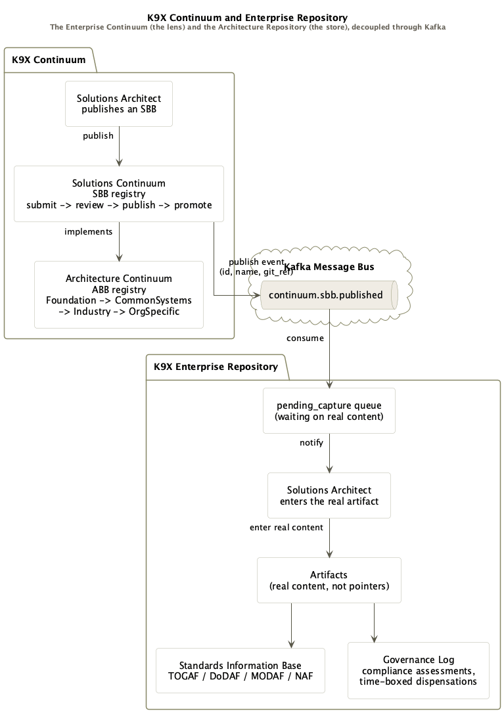

## The Terms Give It Away

I've been applying TOGAF for over a decade now. On more than a few of those projects, the customer never knew it. Not because I hid it, but because a good architecture practice doesn't announce itself. It just flows, it's the natural shape the work takes once you've internalized the discipline enough that you stop reaching for the framework and start reasoning inside it. The customer sees a system that makes sense, that scales cleanly, that survives the requirement changes without a rewrite. They don't see the framework underneath.

But the terms give it away. The artifact names, the way I structure a repository, the vocabulary I reach for without thinking about it, a real Enterprise Architect would recognize every one of them. Not because I'm quoting the standard at them. Because I've been living inside it long enough that it comes out unforced.

That's the test I hold my own work to, and it's the test I've been holding K9-AIF and the K9X ecosystem to for the last fifteen-plus months. Not "does this look like TOGAF in a slide deck." Does it hold up if a real EA opens the actual repository and reads the actual schema.

---

## Fifteen Months, One Discipline

K9-AIF didn't start as an AI framework with TOGAF bolted on for credibility. It started from the same place every serious system I've built has started: OOA, OOD, OOP, the design patterns that have held for thirty years because they're not fashion, they're correct answers to structural problems. ABB and SBB, Architecture Building Block and Solution Building Block, aren't marketing terms in K9-AIF. They're the actual contract-and-implementation split the framework is built on, `BaseAgent` as the abstraction, a concrete agent as the implementation, all the way up through Orchestrators and Squads.

K9X Continuum came next, the governed catalog. Publish an SBB, it can't enter the catalog until `k9aif inspect` confirms it actually honors its ABB contract. Submit, review, publish, promote, an audit trail on every step. Four levels, Foundation through Organization-Specific, the same continuum TOGAF itself defines for classifying architecture assets by how generic or organization-specific they are.

It's solid. It does what it says. But building it out further meant going back to the standard itself and asking a harder question than "does this look TOGAF-aligned."

---

## The Gap a Careful Read Exposes

TOGAF's Enterprise Continuum is a classification scheme, a lens for sorting architecture assets by genericity. It is not, itself, a place things live. The place things live is the Architecture Repository, a distinct structure TOGAF defines with six parts: the Metamodel, the Capability, the Landscape, the Standards Information Base, the Reference Library, and the Governance Log.

Read Continuum against that list honestly, and it becomes clear fast: Continuum built the lens. It didn't build the container. What it stored per SBB was a name, a description, tags, a `git_ref` string you had to trust, and a YAML snapshot. No real artifact content. No Standards Information Base, TOGAF, DoDAF, MODAF, NAF compliance was a free-text tag, not a queryable, versioned thing. No Governance Log in the TOGAF sense, an audit trail of who-did-what is not the same as a record of compliance assessments and time-boxed dispensations.

That's not a small gap. That's the difference between a catalog and a repository.

---

## K9X Enterprise Repository

So that's what got built. A separate service, its own database, its own deployment, connected to Continuum the same way everything else in this ecosystem connects: through Kafka, event-driven, nothing tightly coupled. When an SBB gets published in Continuum, an event goes out. The Repository picks it up, opens a pending-capture entry, and waits. A Solutions Architect still has to walk over and enter the real content themselves. Publishing to Kafka is a notification that content is owed, not a pipeline that fills itself in. The system surfaces the work. A person does it.

That same instinct, let the system surface the decision, don't let it make the decision, shows up again in how an SBB becomes an ABB. Every serious EA practice I've been part of treats that step with real scrutiny: is this pattern actually generic enough to promote, or does it just look reusable from inside one project? I didn't want a `harvest` endpoint that auto-creates or version-bumps an ABB the moment enough SBBs point at it. I wanted the system to do exactly what a peer-review process does: flag the candidate, let architects comment, approve, or reject it, log every round of that scrutiny, and then stop. What happens after acceptance, actually updating the ABB, running it through a real release process, stays a human decision made outside the tool. It's closer to how an IEEE paper gets accepted than how a CI pipeline auto-deploys.

---

## Why This Matters More Than It Looks Like It Does

None of this is a big feature in the sense that makes a good product demo. There's no new button that does something flashy. What's actually there is a Standards Information Base that holds TOGAF, DoDAF, MODAF, and NAF as real, versioned, queryable entities. A Governance Log where a dispensation has to carry an expiry, because TOGAF says exceptions that never expire aren't exceptions, they're just quiet drift. Real artifact content with a source link back to the actual code, not a name and a promise.

I don't think there's another agentic-AI catalog built this way. Not because the idea is exotic, npm has a registry, SwaggerHub has an API catalog, DataHub has a data catalog, but because building a governed artifact repository for agentic components on actual TOGAF terms means you have to know TOGAF well enough to notice when you've only built half of it. That's the same test from the opening: the terms give it away, and so does what's missing when you don't know to look for it.

So here's the question worth sitting with, whether you're building agentic systems or reviewing someone else's: when you strip the demo away and read the actual schema, does the vocabulary hold up? Or does it only work as long as nobody who actually knows the standard looks too closely?

Fifteen months in, K9X Enterprise Repository is the answer I wanted to be able to give when someone does look closely.
