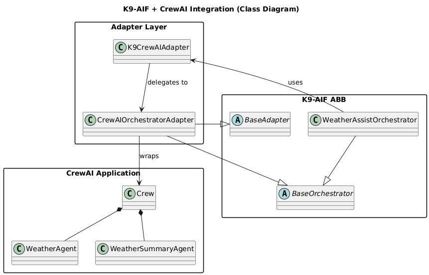
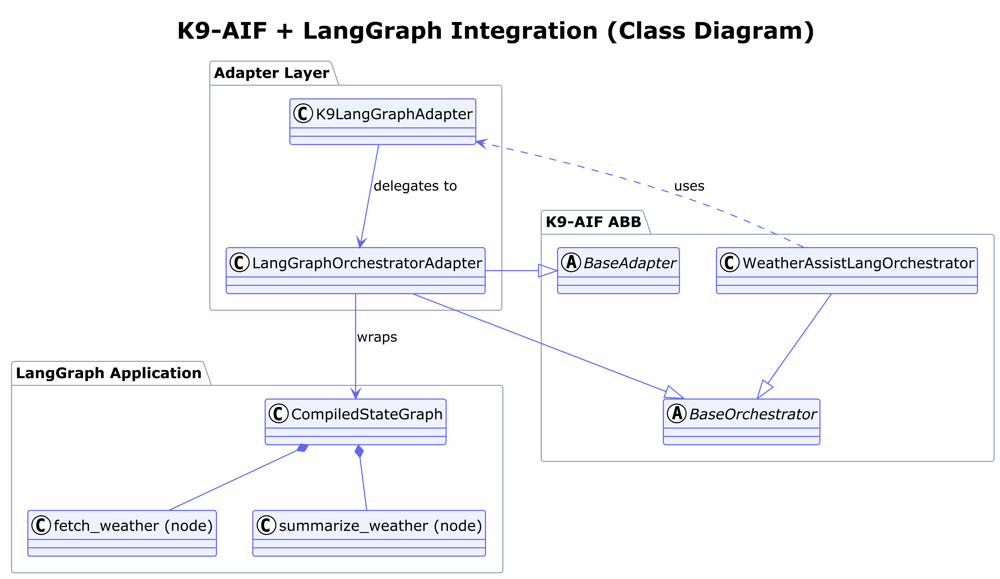
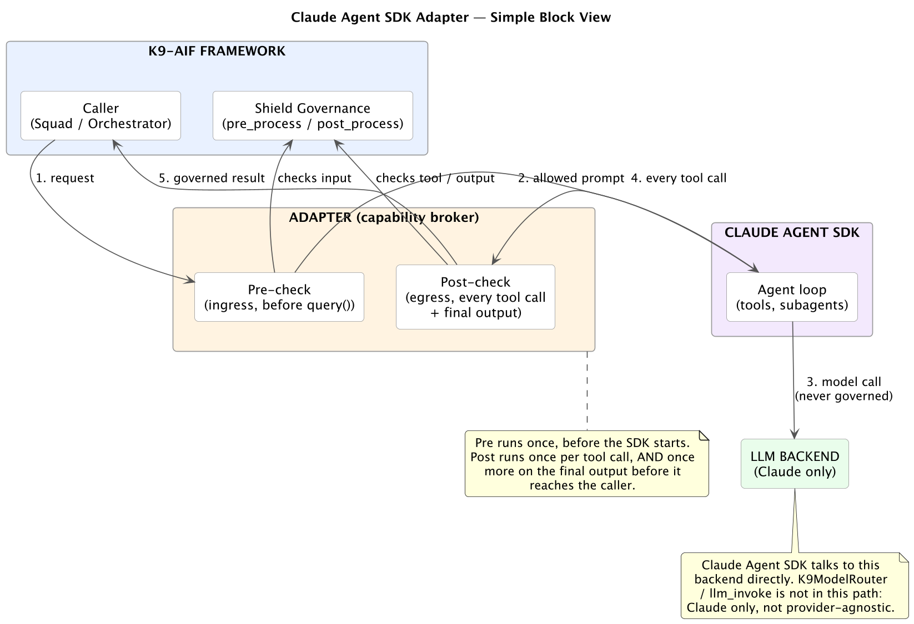

Teams rarely start from a blank page. One team has a CrewAI crew in production, another built its workflow as a LangGraph graph, and a third standardized on Claude and the Claude Agent SDK. Rewriting all of them onto one framework isn't realistic, and it isn't necessary.

This post shows how **K9-AIF works alongside all three**. You keep your crew, your graph or your Claude session exactly as it is. K9-AIF wraps it and brings the same governance and security to each:

- **k9x Shield**: deterministic checks mapped to the OWASP Top 10 for LLM Applications and to the agentic threat vectors Zscaler ThreatLabz describes.
- **Granite Guardian**: a semantic safety layer on top of Shield, run as mandatory and fail-closed.
- **Zero Trust**: identity, role and risk checks before anything executes.
- **Governance enforced by inheritance**: every adapter extends the same `BaseOrchestrator` contract as a native K9-AIF orchestrator, so nothing is special-cased and nothing depends on a developer remembering to call a check.

The first part explains the shared layer. The three sections after it are self-contained, so jump straight to the one you use:

- [1. CrewAI](#crewai)
- [2. LangGraph](#langgraph)
- [3. Claude Agent SDK](#claude-agent-sdk)

The material comes from the integration section of the K9X ecosystem paper submitted to IEEE Access, checked against the framework's current code.

---

## The shared layer: what every adapter inherits {#shared-layer}

### One shape for every framework

All three adapters follow the same three-part shape:

| Part | Job |
|---|---|
| **Facade** (`K9CrewAIAdapter`, `K9LangGraphAdapter`, `K9ClaudeAgentSDKAdapter`) | Accepts a K9-AIF payload and returns a K9-AIF result |
| **Payload mapper** | Translates between K9-AIF payloads and the framework's own input and output, once, at the boundary |
| **Orchestrator adapter** | Extends `BaseOrchestrator` and `BaseAdapter`, applies governance, and runs the wrapped framework |

The wrapped object (a `Crew`, a compiled graph or an SDK session) is not modified. Its tasks, nodes, edges and prompts are exactly what its authors wrote. The adapter sits at the **Orchestrator layer** of K9-AIF's Router → Orchestrator → Squad → Agent hierarchy, because a crew, a graph and an agent session each orchestrate their own steps.

### k9x Shield: the deterministic checks

Shield is a Chain of Responsibility: a payload passes through a sequence of checks, and each check looks for one class of attack. A check either **flags** (logged, the payload continues) or **blocks** (a `PermissionError`, nothing downstream runs). Ingress checks run before a model sees the input; egress checks run on what comes back.

| Shield check | What it catches | OWASP LLM Top 10 (2025) | ThreatLabz vector |
|---|---|---|---|
| `PromptInjectionCheck` | Instructions hidden in input | LLM01 Prompt Injection | Indirect prompt injection |
| `PIIBoundaryCheck`, `PIIRequestCheck` | Personal data crossing a boundary, or being asked for | LLM02 Sensitive Information Disclosure | |
| `HardcodedCredentialCheck` | Secrets in a payload or output | LLM02 Sensitive Information Disclosure | |
| `MemoryPoisoningCheck` | Instructions planted in session memory | LLM04 Data and Model Poisoning | Memory poisoning |
| `OutputSanitizationCheck` | Output that would inject into HTML, JS or templates | LLM05 Improper Output Handling | |
| `ToolAuthorizationCheck`, `ToolArgumentCheck`, `ExecutionGuardCheck` | Unapproved tools, dangerous arguments, unsafe execution | LLM06 Excessive Agency | Shadow AI and tool abuse |
| `SemanticDriftCheck` | Output drifting away from the task | | Goal hijacking and privilege escalation |
| `SystemPromptLeakageCheck` | The agent's own instructions leaking out | LLM07 System Prompt Leakage | |
| `InputSizeCheck`, `RequestFrequencyCheck` | Oversized inputs, request floods | LLM10 Unbounded Consumption | |

You choose which checks run, per direction, in configuration. Adding a new check for the next reported attack vector means adding one handler; nothing else changes.

### Granite Guardian: the semantic layer, mandatory

Shield's checks are fast, explainable and cost no model call, but a determined attacker can paraphrase or encode around a literal rule. IBM's **Granite Guardian** (`granite4.1-guardian:8b`, served by Ollama) judges meaning rather than wording, so it catches what survives the rules.

The two are layered, never swapped: `ChainedGovernance` runs Shield first and Guardian after it, and both stay active.

In the solutions I build, Guardian is **mandatory and fails closed**. If Guardian times out or can't be reached, its verdict is `UNAVAILABLE`, and the `on_unavailable: fail_closed` policy (the default) refuses the request. It is never quietly treated as a pass.

### Zero Trust: before anything executes

Governance defines policy; **Zero Trust enforces it at execution time**. `BaseOrchestrator.apply_zero_trust()` builds an execution context and runs it through the `DefaultZeroTrustGuard`:
1. compromise check;
2. role-based authorization;
3. sensitive-data protection and masking;
4. risk scoring.

The result is a trust decision: allow, deny, or allow with obligations such as masking. A denial stops the request before the wrapped framework is ever called. Zero Trust is opt-in per orchestrator (`enable_zero_trust: true`). More in [K9X Shield, Part 1: Zero Trust for Agentic Systems](/zero-trust-execution-layer-agentic-systems/).

### Wiring it once

The same governance object serves all three adapters:

```python
from k9_aif_abb.k9_security.vulnerability.shield_governance import ShieldGovernance
from k9_aif_abb.k9_governance.guardian_governance import GuardianGovernance
from k9_aif_abb.k9_governance.chained_governance import ChainedGovernance

# Shield first (deterministic), Granite Guardian second (semantic, fail-closed)
governance = ChainedGovernance(
    ShieldGovernance(config=config),
    GuardianGovernance(config=config),
)
```

```yaml
security:
  shield:
    enabled: true
    ingress:
      checks: [InputSizeCheck, PromptInjectionCheck, PIIBoundaryCheck]
    egress:
      checks: [SemanticDriftCheck, ToolArgumentCheck, ExecutionGuardCheck, PIIBoundaryCheck]

governance:
  guardian:
    enabled: true
    model: granite4.1-guardian:8b
    on_unavailable: fail_closed      # Guardian down = request refused

enable_zero_trust: true
```

Every Shield verdict, Guardian verdict and Zero Trust decision is also emitted to K9-AIF's trace-event bus, so the audit trail looks the same whichever framework did the work.

---

## 1. CrewAI {#crewai}

**What gets wrapped:** an unmodified CrewAI `Crew`, a team of role-based agents working through tasks.

**How:** `K9CrewAIAdapter` (the facade) hands the payload to `CrewAIOrchestratorAdapter`, which extends `BaseOrchestrator` and `BaseAdapter`. The crew is governed through inheritance, exactly like a native K9-AIF orchestrator; there's no special case in the governance pipeline.



**The request path:**

1. **Zero Trust:** the K9-AIF orchestrator that owns the crew calls `apply_zero_trust()`. A denial ends the request here.
2. **Ingress governance:** `apply_pre_governance()` runs Shield's ingress checks, then Granite Guardian, on the crew's input. A prompt-injection attempt is refused before `crew.kickoff()` runs.
3. **The crew runs:** `crew.kickoff(inputs=...)`, untouched.
4. **Egress governance:** `apply_post_governance()` runs Shield's egress checks and Guardian on the crew's result before it's returned.
5. **Observability:** the adapter publishes `CrewAISessionStarted` and `CrewAISessionCompleted`, alongside the governance trace events.

```python
from k9_aif_abb.k9_adapters.crewai.k9_crewai_adapter import K9CrewAIAdapter
from k9_aif_abb.k9_core.orchestration.base_orchestrator import BaseOrchestrator

class ClaimsOrchestrator(BaseOrchestrator):
    def __init__(self, config, governance, crew):
        super().__init__(config=config, governance=governance)
        self.crew_adapter = K9CrewAIAdapter(crew=crew, config=config, governance=governance)

    def execute_flow(self, payload):
        trust = self.apply_zero_trust(payload)
        if not trust["allowed"]:
            raise PermissionError(trust["reason"])
        return self.crew_adapter.execute(trust["payload"])   # Shield + Guardian inside
```

**Try it:** the `weather_assist` example in the framework repository wraps a two-agent crew (look up the weather, then summarize it) around a real Open-Meteo call. Its web UI shows a prompt-injection "city" being refused by Shield before the crew starts.

---

## 2. LangGraph {#langgraph}

**What gets wrapped:** an unmodified compiled `StateGraph` (a `CompiledStateGraph`, which exposes `invoke()`): nodes, edges and state, exactly as built.

**How:** `K9LangGraphAdapter` and `LangGraphOrchestratorAdapter` follow the identical facade, orchestrator adapter and payload mapper shape as CrewAI. The graph sits at the Orchestrator layer for the same reason a crew does: a compiled graph orchestrates its own nodes. Only the wrapped construct differs.



**The request path:**

1. **Zero Trust:** `apply_zero_trust()` in the owning K9-AIF orchestrator.
2. **Ingress governance:** Shield ingress, then Granite Guardian, on the graph's input state, before `invoke()` is called.
3. **The graph runs:** `graph.invoke(...)`, with every node and edge untouched.
4. **Egress governance:** Shield egress and Guardian on the final state before it's returned.

```python
from k9_aif_abb.k9_adapters.langgraph.k9_langgraph_adapter import K9LangGraphAdapter

graph = builder.compile()                 # your existing LangGraph graph
graph_app = K9LangGraphAdapter(graph=graph, config=config, governance=governance)

result = graph_app.execute({"query": "What's the weather in Atlanta?"})
```

Because the governance object is the same one used for CrewAI, the policy is identical: the same Shield checks, the same Guardian model, the same fail-closed rule. A team moving a workflow from a crew to a graph, or running both, doesn't re-implement security.

**Try it:** `weatherAssistLang` in the framework repository mirrors `weather_assist` exactly: the same two-step task, the same real weather call, the same governance configuration, wrapped around a two-node graph instead of a two-agent crew.

---

## 3. Claude Agent SDK {#claude-agent-sdk}

**What gets wrapped:** a Claude Agent SDK session, with Claude running its own agent loop, calling tools and optionally spawning subagents.

**How:** `ClaudeAgentSDKOrchestratorAdapter` extends the same `BaseOrchestrator` and `BaseAdapter` contracts, and acts as the **sole capability broker**. Tools reach the SDK only through the adapter's own registry (`ToolCapability` entries), and the SDK's `can_use_tool` callback, the single path by which any tool call is allowed or denied, is wired straight into K9-AIF governance.



This adapter governs at four points, not two:

1. **Zero Trust:** `apply_zero_trust()` runs inside the adapter before the session starts; a denial means no SDK call is made at all.
2. **Ingress governance:** the prompt passes through Shield's ingress checks and Guardian.
3. **Every tool call:** each tool call Claude attempts, including calls from SDK-spawned subagents, goes through `can_use_tool` into `apply_post_governance()`. A `PermissionError` from Shield or Guardian becomes a structural tool refusal (`PermissionResultDeny`). It isn't an application-level check someone could forget.
4. **Egress governance:** the final output passes through Shield's egress checks and Guardian.

```python
from k9_aif_abb.k9_adapters.claude_agent_sdk.claude_agent_sdk_orchestrator_adapter import (
    ClaudeAgentSDKOrchestratorAdapter, ToolCapability)
from k9_aif_abb.k9_adapters.claude_agent_sdk.k9_claude_agent_sdk_adapter import K9ClaudeAgentSDKAdapter

lookup = ToolCapability(name="lookup_policy", description="Look up a policy by number",
                        input_schema={"policy_no": str}, handler=lookup_policy)

orchestrator = ClaudeAgentSDKOrchestratorAdapter(
    capabilities=[lookup],
    system_prompt="You are a claims assistant.",
    config=config, governance=governance,        # same Shield + Guardian object
    enable_zero_trust=True,
)
claude_app = K9ClaudeAgentSDKAdapter(capabilities=[lookup], orchestrator_adapter=orchestrator)

result = claude_app.execute({"query": "Is policy P-1042 active?"})
```

**One boundary to know about:** K9-AIF governs everything this session *does*: its input, every tool call and its output. The model's own reasoning stays with Claude: the SDK has no seam for injecting a different model, so K9-AIF's model router doesn't choose the model for this adapter. I think of it as **action governance without inference governance**, and it's a stated boundary rather than a gap. My earlier post, [Claude Agent SDK in K9-AIF: Govern What It Does, Not How It Thinks](/claude-agent-sdk-governance-boundary/), goes deeper on it.

---

## The takeaway

Three very different ways of building agents (a crew of roles, a compiled graph, an autonomous session) plug into K9-AIF through one shape. Each inherits the same governance from the same base contract:

| | CrewAI | LangGraph | Claude Agent SDK |
|---|---|---|---|
| Wrapped, unmodified | `Crew` | `CompiledStateGraph` | SDK session |
| Zero Trust | in the owning orchestrator | in the owning orchestrator | inside the adapter, before the session |
| Shield + Guardian on input | ✓ | ✓ | ✓ |
| Shield + Guardian on every tool call | | | ✓ (via `can_use_tool`) |
| Shield + Guardian on output | ✓ | ✓ | ✓ |
| Guardian unavailable | request refused | request refused | request refused |

To bring a fourth framework in, `SKILLS.md` Skill 16 in the framework repository documents the recipe: a facade, a payload mapper, and an orchestrator adapter that extends `BaseOrchestrator`.

---

## References

- K9-AIF framework: [github.com/k9aif/k9-aif-framework](https://github.com/k9aif/k9-aif-framework) (`pip install k9-aif`); adapters in `k9_aif_abb/k9_adapters/`, examples in `examples/weather_assist` and `examples/weatherAssistLang`
- [From Agents to Architecture: Integrating CrewAI into K9-AIF](/crewai-application-and-k9-aif/)
- [K9X Shield: Chain of Vulnerability Tests](/k9x-shield-chain-of-vulnerability-tests/)
- [K9X Shield, Part 1: Zero Trust for Agentic Systems](/zero-trust-execution-layer-agentic-systems/)
- [Claude Agent SDK in K9-AIF: Govern What It Does, Not How It Thinks](/claude-agent-sdk-governance-boundary/)
- OWASP Top 10 for LLM Applications (2025): [owasp.org](https://owasp.org/www-project-top-10-for-large-language-model-applications/)
- Zscaler ThreatLabz: [zscaler.com/threatlabz](https://www.zscaler.com/threatlabz)
- IBM Granite Guardian: [huggingface.co/ibm-granite](https://huggingface.co/ibm-granite)
